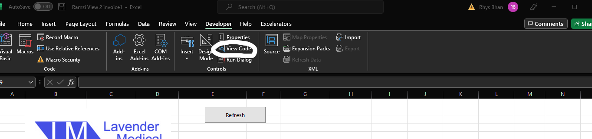
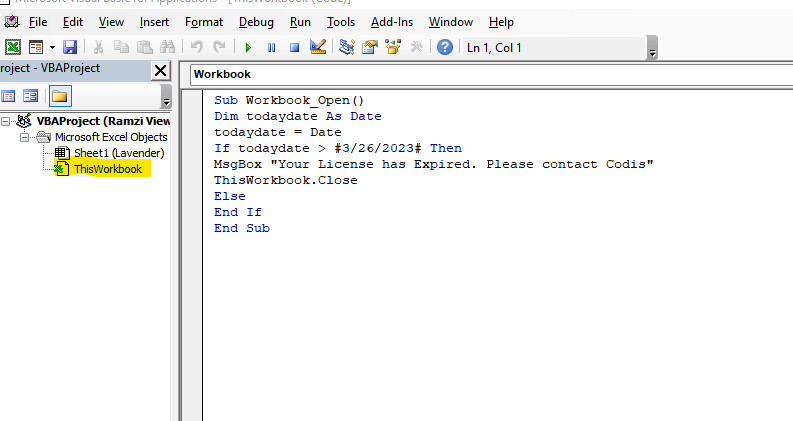

[Ramzi Views.xlsm](https://codislimited.sharepoint.com/sites/Wiki/Documents/Ramzi%20Views.xlsm)  

He is using this pivot table report to refresh data from his database and then generate reports for specific Sales Rep, save it in the email (drafts folder).  

This workbook/report is digitally signed by Codis certificate and VBA project is locked with password \- L@\\/3nDerV8Apr0JEcT!  

PLEASE DO NOT SHARE THE VBA PROJECT PASSWORD WITH ANYONE OUTSIDE CODIS (Dont share with Lavender either)  

  
Prerequisits   

\- Outlook should be configured where this file is running (specifically generating reports because it will save draft in outlook)  

\- The machine/user should be on companies network i.e he/she should have database access to download data from Server.  

  

Codis\_CarriageValue  

SELECT        SUM(dbo.SOPOrderReturnLine.LineTotalValue) AS Expr1, dbo.SOPOrderReturn.DocumentNoFROM            dbo.SOPOrderReturn FULL OUTER JOIN                         dbo.SOPOrderReturnLine ON dbo.SOPOrderReturn.SOPOrderReturnID \= dbo.SOPOrderReturnLine.SOPOrderReturnIDWHERE        (dbo.SOPOrderReturnLine.ItemCode LIKE '%Carriage%') OR                         (dbo.SOPOrderReturnLine.ItemDescription LIKE '%Carriage%')GROUP BY dbo.SOPOrderReturn.DocumentNo  
  

Codis\_LavenderVw  

SELECT        dbo.SOPOrderReturnLine.LineTotalValue, dbo.SLCustomerAccount.AnalysisCode1 AS \[Sales Rep], dbo.SOPOrderReturn.DocumentNo, CONVERT(DATE, dbo.SOPOrderReturn.DocumentDate) AS \[Doc Date],                          dbo.SOPOrderReturnLine.ItemCode, dbo.SOPOrderReturnLine.LineTotalValue AS Expr1, dbo.StockItem.Name, dbo.StockItem.AnalysisCode1 AS Indication, dbo.ProductGroup.Code AS Group\_Code,                          dbo.ProductGroup.Description AS Group\_description, dbo.SLCustomerAccount.AnalysisCode1 AS Territory, dbo.SLCustomerAccount.AnalysisCode2, dbo.StockItem.AnalysisCode2 AS \[Set Name], CONVERT(DATE,                          dbo.SOPOrderReturn.DocumentDate) AS \[Weekly Date], dbo.DocumentStatus.Name AS \[Document Status], CONVERT(DATE, dbo.SOPInvoiceCredit.DocumentDate) AS \[Inv Doc Date],                          dbo.SOPOrderReturnLine.ItemDescription, dbo.SOPDocDelAddress.PostalName, dbo.SLCustomerAccount.CustomerAccountName, dbo.SLCustomerAccount.CustomerAccountNumber,                          dbo.SOPOrderReturn.CustomerDocumentNo, CASE WHEN (soporderreturn.documenttypeid) \= 1 THEN (SOPInvoiceCreditLine.linetotalvalue \* (\- 1\)) ELSE (SOPInvoiceCreditLine.linetotalvalue) END AS TotalValue,                          dbo.SOPInvoiceCreditLine.InvoiceCreditQuantity AS LineQuantity, dbo.SOPInvoiceCreditLine.LineTotalValue AS Expr2, dbo.SOPOrderReturn.TotalNetValue AS NetValue,                          dbo.SOPOrderReturn.SubtotalDiscountValue, dbo.Codis\_CarriageValue.Expr1 AS CarriageTotal, dbo.SOPInvoiceCreditLine.PrintSequenceNumberFROM            dbo.SLCustomerAccount INNER JOIN                         dbo.SOPOrderReturn ON dbo.SLCustomerAccount.SLCustomerAccountID \= dbo.SOPOrderReturn.CustomerID INNER JOIN                         dbo.DocumentStatus ON dbo.SOPOrderReturn.DocumentStatusID \= dbo.DocumentStatus.DocumentStatusID LEFT OUTER JOIN                         dbo.Codis\_CarriageValue ON dbo.SOPOrderReturn.DocumentNo \= dbo.Codis\_CarriageValue.DocumentNo RIGHT OUTER JOIN                         dbo.StockItem INNER JOIN                         dbo.ProductGroup ON dbo.StockItem.ProductGroupID \= dbo.ProductGroup.ProductGroupID RIGHT OUTER JOIN                         dbo.SOPOrderReturnLine ON dbo.StockItem.Code \= dbo.SOPOrderReturnLine.ItemCode ON dbo.SOPOrderReturn.SOPOrderReturnID \= dbo.SOPOrderReturnLine.SOPOrderReturnID LEFT OUTER JOIN                         dbo.SOPDocDelAddress ON dbo.SOPOrderReturn.SOPOrderReturnID \= dbo.SOPDocDelAddress.SOPOrderReturnID LEFT OUTER JOIN                         dbo.SOPInvoiceCreditLine INNER JOIN                         dbo.SOPInvoiceCredit ON dbo.SOPInvoiceCreditLine.SOPInvoiceCreditID \= dbo.SOPInvoiceCredit.SOPInvoiceCreditID ON                          dbo.SOPOrderReturnLine.SOPOrderReturnLineID \= dbo.SOPInvoiceCreditLine.SOPOrderReturnLineIDWHERE        (dbo.SOPOrderReturn.DocumentTypeID IN (0, 1\)) AND (dbo.SOPOrderReturnLine.ItemCode NOT LIKE 'Carriage%') AND (NOT (dbo.SOPOrderReturnLine.ItemDescription LIKE 'Carriage%'))  
  
  
  
  
  
On 26\-03\-2023 this report will not work (automatically close if someone opens it with a Message Box "Your License has Expired. Please contact Codis")  
  
Check with Sales if they have paid for the report and then go to VBA from developers tab   
Enter the password L@\\/3nDerV8Apr0JEcT! then double click Thisworkbook from the left window(VBA\-Project) and Extend the date in line If  todaydate \> \#3/26/2023\# with a year and Save the Macro enabled workbook.
