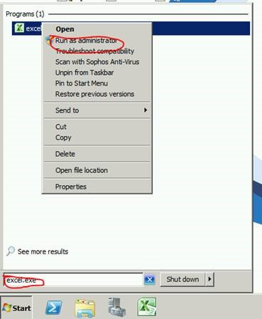

Please see the instructions on how to generate a request code:

- Open up Excel as Administrator

 

- Click 'Excelerator' tab at the top
- Click on 'Licences'

A box will appear on the screen

- Click 'License' on the top left

A drop\-down box will appear

- Ensure 'I am using a Desktop' is selected (even if using a laptop)
- Click 'Request a License'
- Click 'Generate Request Code'
- Click 'Copy to Clipboard'
- Paste into email and send to licensing@codis.co.uk

You will then receive an activate code via email from us. When you do

- Click on 'Enter Activation Code'
- Click 'Activate Product' at the bottom
