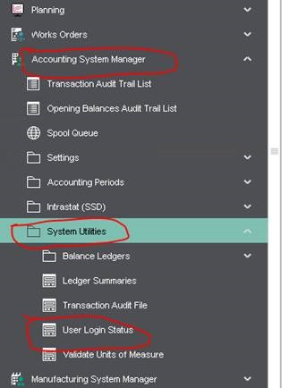
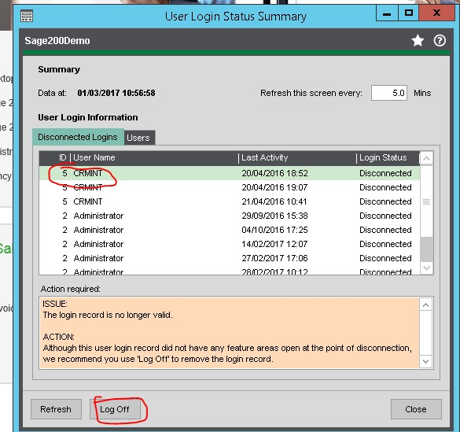

Log in to Sage 200 with an admin account, then go to Accounting System Manager \-\> System Utilities \-\> User Login Status 

 

You should be able to see any disconnected sessions and users, kill them by clicking "log off." Note that this is per company. You will have to check other companies via the same process.

 
