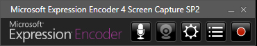
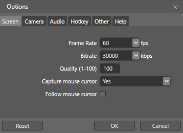
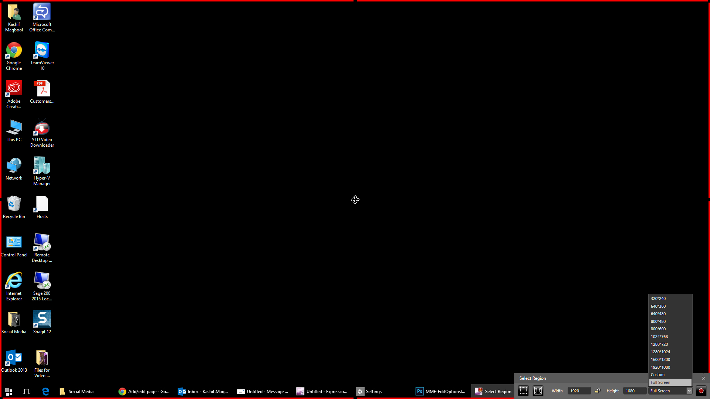
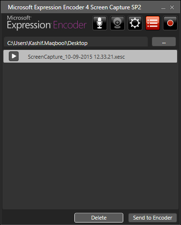
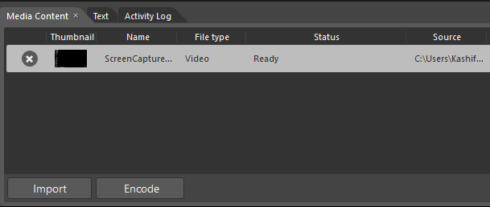
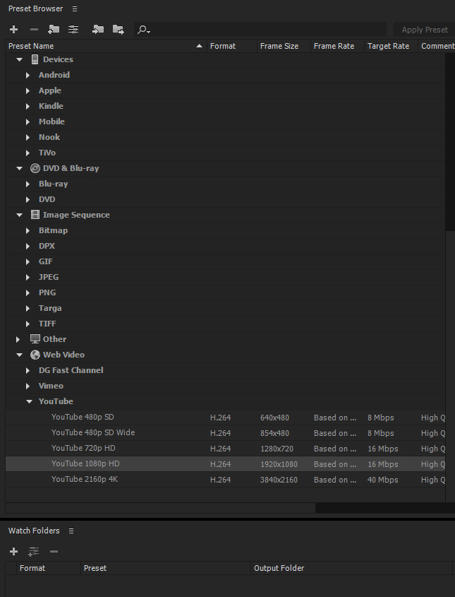
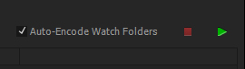

Microsoft Expression Encoder is a screen capture tool used by the marketing department. It differs from [Snagit](https://codislimited.sharepoint.com/sites/Wiki/Marketing/Marketing%20Wiki/Videos/Snagit-13-Overview.mp4)because it allows capturing in higher quality (60 frames per second, full HD).

This page outlines the steps to take a capture. 

## Installation

Microsoft Expression Encoder 4 can be installed from the [Software Setups](file://///cd01dc16102/SoftwareSetups/Microsoft®/Microsoft%20Expression%20Encoder%204%20with%20Service%20Pack%202) folder. Follow the instructions during the installation process and contact your Network Administrator for the Activation Key. 

After installation is complete, you can find Microsoft Expression Encoder Screen Capture under Start \> All Programs \> Microsoft Expression \> Microsoft Expression Encoder 4 Screen Capture. You will see the following interface once the program is launched: 

 

Buttons (L\-R): Audio, Webcam, Edit Options, Capture Manager, Record

## Setting the frame rate

Before you begin to capture video, you should set the frame rate to a higher quality (the default is 15 frames per second). To do this, click on the Edit Options button. 

In Options, the default tab is Screen. Here, set the frame rate from 15fps to 60fps and set the quality from 95 to 100\. Click OK. 

You will need to apply these settings each time you use Encoder

 

## Setting the capture region and recording

Once you have set the frame rate, click the Record button. You can now specify the size of the area you want to capture by dragging the red outlines. If you wish to capture the full screen, select Full Screen from the drop\-down menu in the Select Region dialog box: 

 

Once desired size has been set, click Record for a three second countdown until recording begins. You can now carry out the actions you want recorded on video. If you are capturing at full screen, the button interface will be hidden during the recording process. If this is the case, you can pause recording using CTRL \+ SHIFT \+ F11 and stop recording using CTRL \+ SHIFT \+ F12\. 

## Previewing the screen capture

When you have stopped capturing your screen, you will see the file name of the video you have just captured. Click the Play button to watch a preview of the video. If you are happy with it, click Send to Encoder: 

 

Note: Here you can also change the default location of where your completed videos output by choosing a new path. In the example above, the default location has been changed to Desktop.

## Encoding the video

After sending your video to the encoder, your video now sits in the Encoding tool. You can now send your video for encoding by clicking the Encode button in the bottom left of the encoding tool: 

 

The video will be encoded in WMV. Once the encoding process is complete, your video will be saved in the location you specified in the previous step. 

## Re\-encoding the video

WMV is not the preferred format for videos. Therefore you can re\-encode the video to MP4 by opening the file in Adobe Media Encoder (part of the Adobe Creative Cloud suite). 

Once you're in Adobe Media Encoder, click on File \> Add Source and browse for the WMV file. Then select the output on the right side of the tool to YouTube 1080p HD: 

 

Click the green play button located at the top center to begin re\-encoding the video: 

 

Once finished, the video is ready for use.
