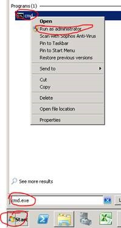
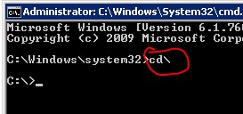
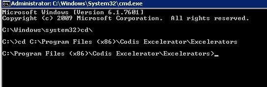
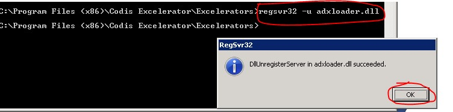
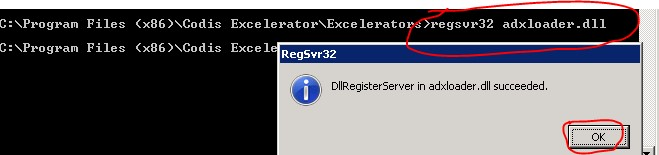
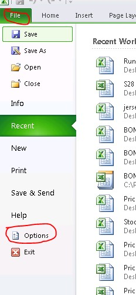
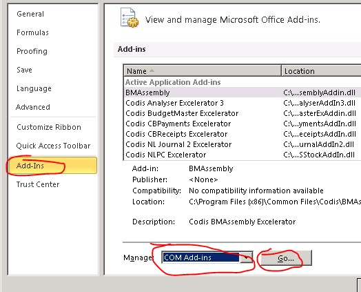
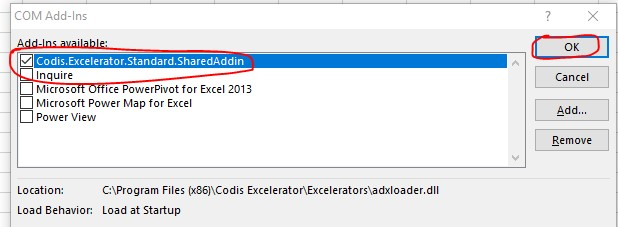

Before you apply solution below please close all Excel.

 Please see step by step instruction below to resolve missing Excelerator tab. 

1\.       Log in to the pc as user and run command prompt as Administrator (see below)

 

2\.       CD\\ and Enter

 

 

3\.       Unregister adxloader.dll to do so type in (regsvr32 –u adxloader.dll) and press Enter (see below)

 

4\.       Register adxloader.dll (type in regsvr32 adxloader.dll) and press Enter (See below)

 

5\.       Once its successfully registered, open excel as normal and see if Excelerator tab is displayed, if not. Follow instruction below. 

6\.       In Excel, click on File and select Options.

 

7\.       Select Add\-Ins and from Manage drop down list select COM Add\-Ins and Click Go (see below)

 

8\.       If Codis Excelerator option is not ticked in box below, tick it and select OK.

 

Also click on link to our webpage help below on how to resolve missing Excelerator ribbon issue;

[http://www.codis.co.uk/excelerator\-help/quick\-installation\-instructions/common\-installation\-issues/issue\-1\-\-\-excelerator\-ribbon\-not\-present](http://www.codis.co.uk/excelerator-help/quick-installation-instructions/common-installation-issues/issue-1---excelerator-ribbon-not-present)
