## Overview

Codis have provided an interface for Mollies hotels between [Apaleo](https://apaleo.com/) \- a hotel management system, and Sage 200\.    The hotel management system records revenue from various sources \- room payments, restuarants etc.  This revenue is recorded in their Sage 200 via a NL Journal.    

## Deployment

The interface consists of the Orchestrator framework, an Apaleo plugin used by Orchestrator and a Codis Sage 200 NL Webservice.  All are deployed to the Mollies Sage 200 Server.  

To download the data from Apaleo, we need to create a Connected app in their system. Refer below screen shot for the same. We need this App's ConnectId and Secret as those are used to download the data from Apaleo APIs.  

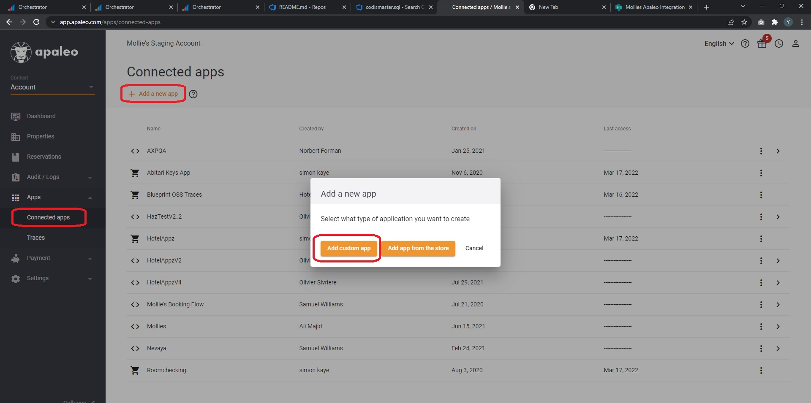  

Provide the required details like Client code, Client name, Secret description etc.  

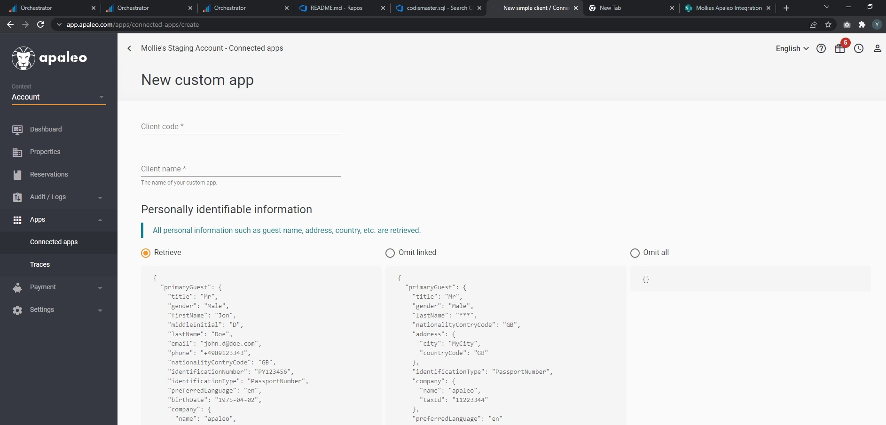  

The connected App must have 'accounting.read' scope selected, else App won't be able to download Accounting related data which is what we need. Once done click Save and keep the ConnectId and Secret which are provided in web.config file in Orchestrator web application as shown in below screen shot.  

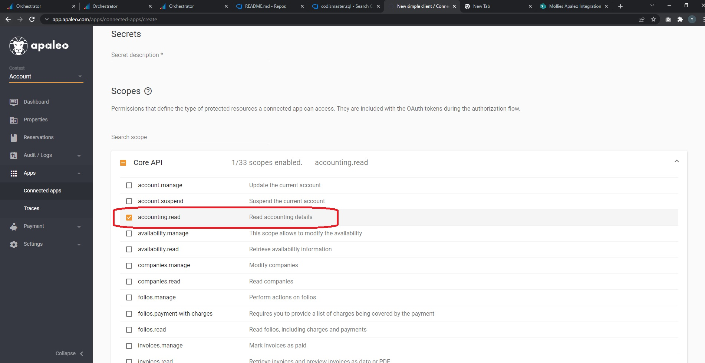  

Below values are for example only, should be updated as per the App created.  

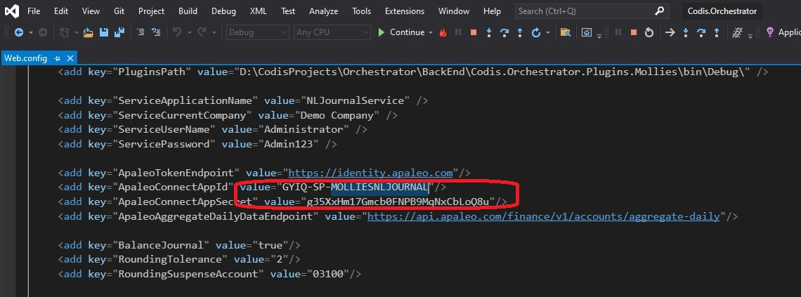  

## Incoming Data

The Apaleo webservice provides revenue details for a range of dates as sets of three movements\-  

1. The net revenue and a product code
2. VAT
3. A control posting to contra these.

This webservice is queried in the morning to retrieve the previous day's transactions.  
  
## Data Translation

The NL account code for revenue is based on the product being provided and the department is based on the hotel.  The hotel (property) code is not part of the response received but is known by the plugin, so the plugin appends the property code to the product code, and this combination is mapped to a GL code.  

For visualization, refer below screen shot. We download the data from Apaleo which is 'Total debited and credited' for a particular day for a particular Property e.g. Oxfordshire(MOLBUCK) here. Refer below Excel screen shot which shows the downloaded data from this User interface. We actually download this data from API in our code, hence that structure is bit different i.e JSON, but data is same.  

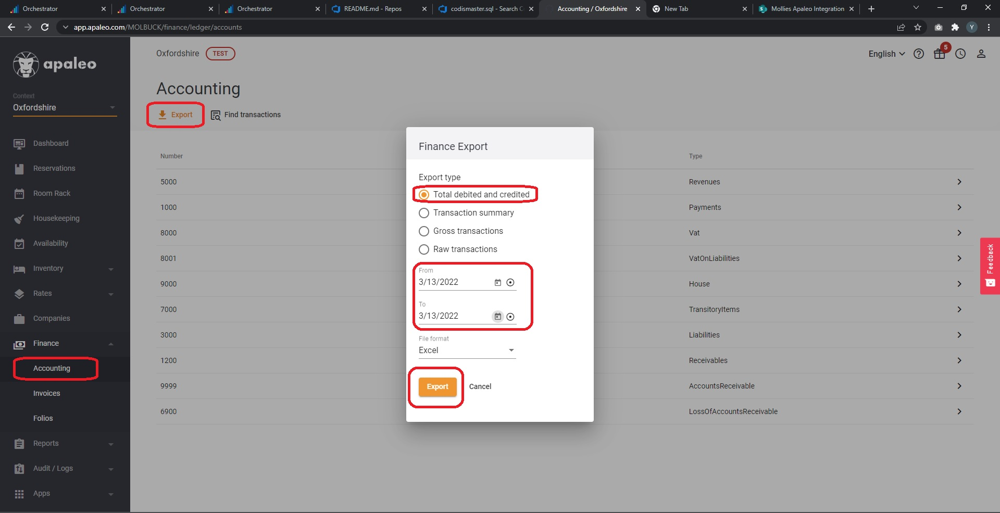  

Downloaded data fro Apaleo User interface  

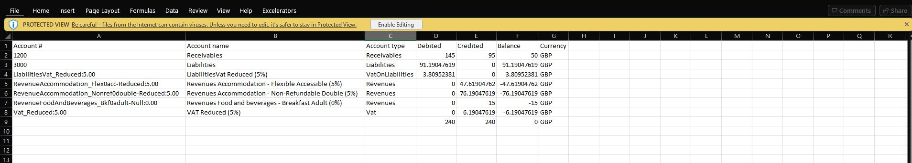  

We then transform this data in our code into required DTO, but for understanding you can visualize that as below screen shot. We create this data as per Mappings configured in Orchestrator for Nominal code, Vat type and Vat code, so below data is an illustration, actual Nominal code, Vat code and Vat type can be different. For this example we have considered only balances from above data as Mollies wanted only Balances in their Journal.  

NOTE : We created couple of Plugins for Mollies, once creates data with Balance only and One creates data with Debits/Credits.  

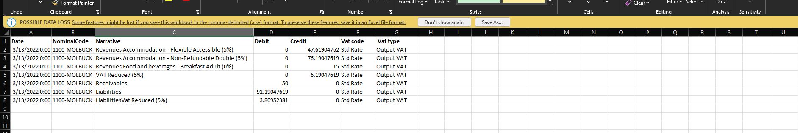  

  

## Outgoing Data

The plugin creates one journal per day of transactions.  Saved journals are tracked in Orchestrator .  

They currently post Journals manually from New Run section in the User Intergace. Orchestrator has the ability to schedule runs from the Scheduled section in User Intergface.  

Please click this [link](Orchestrator (Support notes).md#chapter3) to understand how to Create Schedules.  

Note \- Orchestrator can create Held or Posted Journals from Manual Runs and even Schedules.  

## Create/Update/Amend Mappings

- Login to Mollies server with the Codis Admin details (Username: Mollies\\Molliesadmin, Password: R0seW@ter)
- Open a web browser and open the link http://localhost/S200Integration/ or http://mollies/S200Integration/
- Login to the Orchestrator UI with (User Name \- administrator , Password \- admin)
- Click on the field mapping section.
- 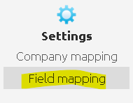
- select Apaleo Integration in the first dropdown, select the Sage company that you want to use in the second drop down.
- 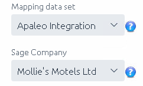
- The third dropdown is for Nominal, VAT Code and VAT Type mapping. Mollies use all three.
- Click on the delete icon to delete a mapping
- 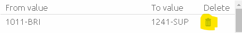
- To add a new mapping enter from value(3rd party eg \- Apaleo) and to value (Sage company value) \> click add and then click Save.
- 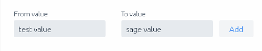
- To Amend a mapping you can
- Click on copy to Excel
- Paste the copied mapping to Excel
- Make the changes on Excel.
- Copy the updated mapping from Excel.
- Click on Paste from Excel in Orchestrator UI.
- Click Save to apply the changes.
- 

Note \- Please make sure to take a copy of all the mappings in an Excel File before making changes.Note\* \- Current Mappings for Apaleo (as of 15\-03\-2022\)[Mollies Mappings.xlsx](https://codislimited.sharepoint.com/sites/Wiki/Documents/Mollies%20Mappings.xlsx) . Please update it as you make changes.  

##
