**This is a list of licensing tasks as per the new system.** 

## Standard

### 

### Adding a new Standard License

(Licenses can now be added without a Purchase Order)

**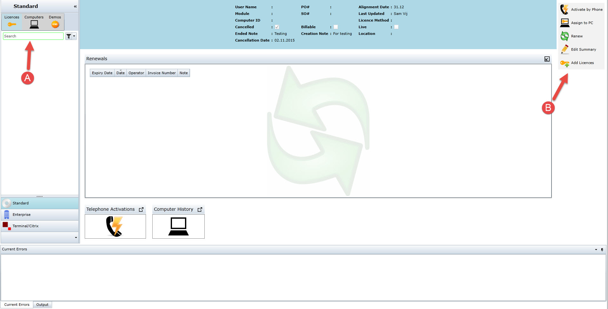** 

**A**: The Search box allows a search for any part of a product name/user name/computer ID, licence ID, to make it easier for long lists. This list only includes the Standard Excelerator licences that this particular Company has purchased. 

**B**: Click on "**Add License** " and the following screen will appear. 

**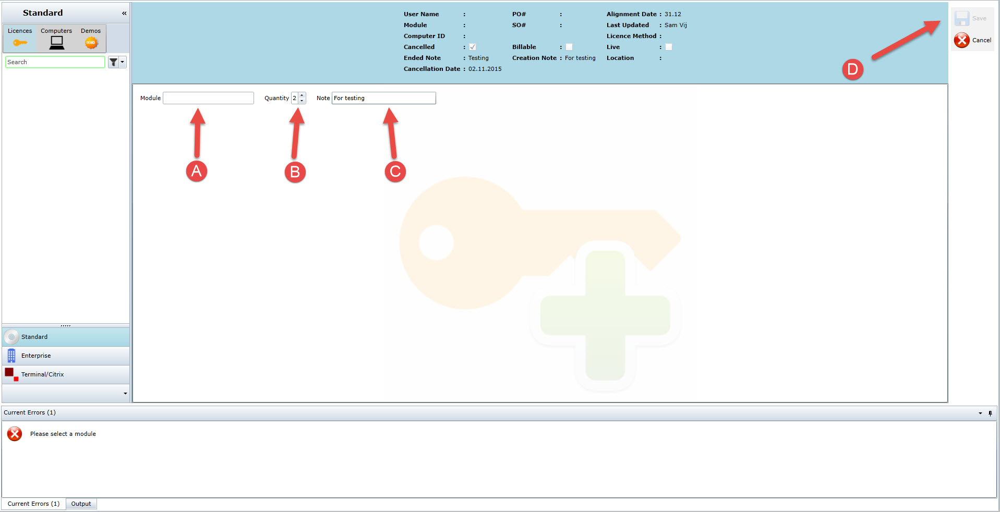** 

**A**: Type in the required **module** (When entering a drop down list of modules will appear. 

**B**: The quantity is the amount of modules needed. A **maximum of 5** can be selected at one time. So if there is more than 5 needed you need to activate the **module twice** . 

**C**: You must enter an **explanation** as to why the license has been added without an order. 

**D**: Click **save** once all details are entered. 

(A pop up will appear saying **"These are not billable".** You can change to billable yourself after) 

**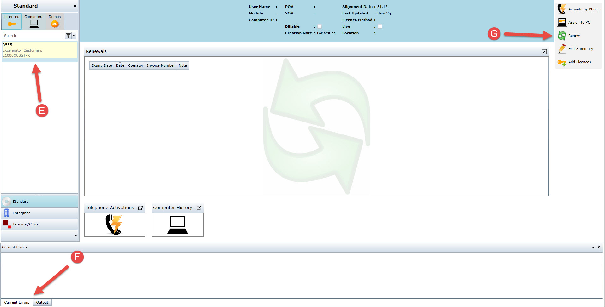** 

**E**: The module will appear **yellow** as it has not been assigned or live yet. You must then click on the license and configure it. 

**F**: Two errors boxes. The one labelled **"Current Errors"** will show any errors messages that occur when saving a license in red. Anything that appears in the **"Output"** box means it is a technical error. 

**G**: Click on **"Renew"** and the following screen will appear. 

**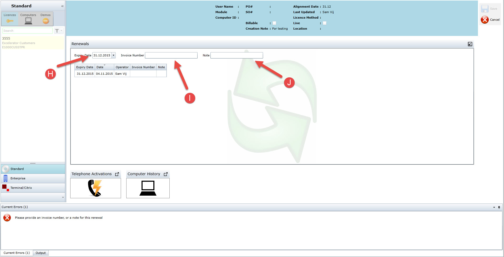** 

**H**: Click on **"Expiry Date"** and a drop down calendar will appear select the relevant date. 

**I**: Enter the **"invoice number"** that is on the company's purchase order. 

**J**: Enter a **"Note"** regarding the license. 

### 

### Adding a computer

The next step will be to assign the License to a **"New Computer"**. 

**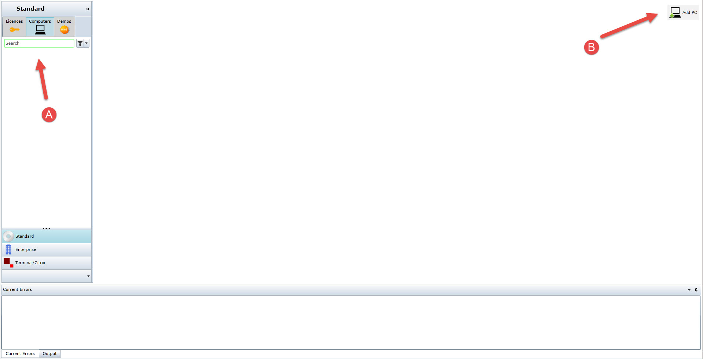** 

**A**: This section will show you how many **"PC'S"** have been added to this company. 

**B**: Click on **"Add PC"** and the following screen will appear. 

**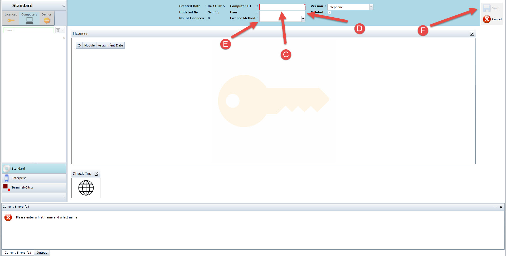** 

**C**: Enter the computer's Id in the **"Computer Id"** box. 

**D**: Enter the **"User's name"** who will be using this PC. It can be an existing user or a non existing user. 

**E**: Click on **"License Method"** a drop down menu with **A,B,C and D** will appear select the required type. 

**F**: Now click on **"Save"** to add the PC you have just created. 

### 

### Adding A License to a PC

Once a PC has been added it is time to add a module(s) to that PC. 

**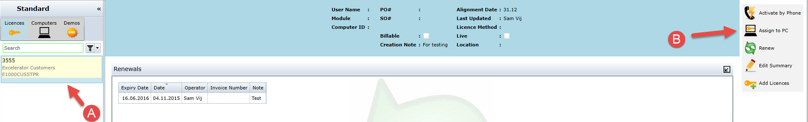** 

**A**: Click on this license that is still yellow as it is not live and not assigned to a PC as of yet. 

**B**: Click on **"Assign to PC"** and the following screen will appear. 

**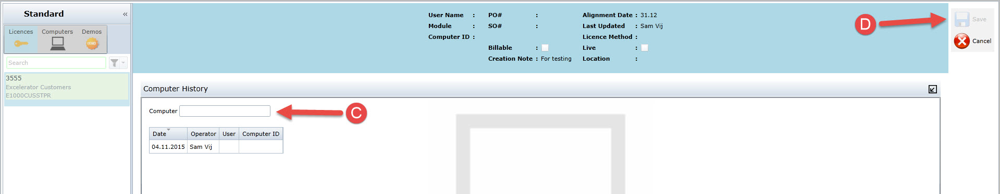** 

**C**: Enter the computer ID of the PC that have been installed on this users account. You can either enter the computer ID or the users names to allocated the selected module. 

**D**: Click on **Save** and the module will be assigned to the PC. (As shown below) 

**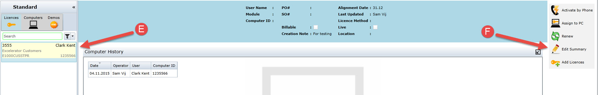** 

**E**: This is how the module will look once a PC has been assigned to it.. (Still **yellow** as it has not been made live yet.) 

**F**: Click on **Edit Summary** to open the following screen to make the module live. 

**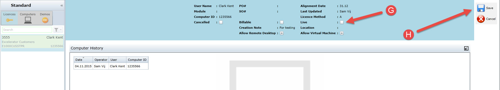** 

**G**: Click on the box next to where it says **Live** to activate this module. 

**H**: Now you may click on save to complete this task. 

**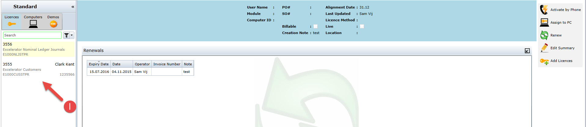** 

**I**: Notice now that the module has been assigned to a PC and live it is not **yellow** anymore it has now gone **white**. 

### 

### Activate by Phone

When there is an Active license that has been assigned to a PC you may now activate this module **Over the phone** 

**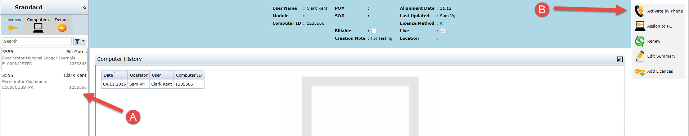** 

**A**: Click on the relevant **Module** that you want to activate by phone on the left hand side of the screen in the search box. 

**B**: Go over to the right hand side of the screen now and click **Activate by phone** which will show you the following screen. 

**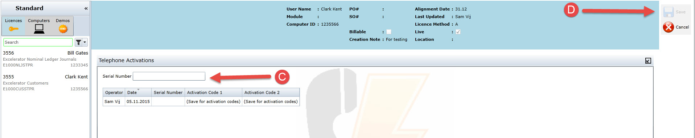** 

**C**: You can now enter the **Serial Number** given to you by the customer on the other end of the phone. 

**D**: The option to **Save** on the right hand side will now be available. Go over and select the **Save** button which will reveal the activation codes. ( See below ) 

**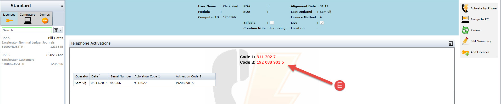** 

**E**: Give the Customer the 2 Codes which they enter on their system before they click **'OK'**. 

### 

### Online

### Demo

Demo Licenses can only be issued as demo's now there are no more unrestricted demos. Also when a company purchases a new module they have never purchased/used before they automatically get a demo with it. 

How to create a new demo: 

(online) 

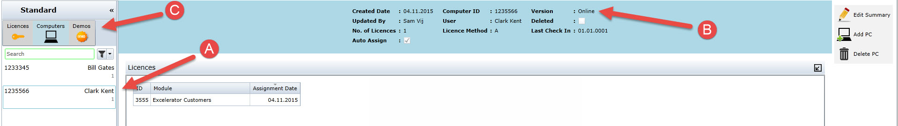 

We will start with a demo license for an online computer. 

**A**: The selected computer of **Clark Kents** is selected now. 

**B**: You can see that **Clark Kent's** License is **Online**. 

**C**: Click on the **Demo** tab to start adding a new one. 

**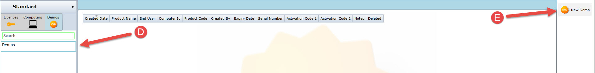** 

**D**: Select the **Demos** tab on the left hand side. 

**E**: Now go to the right hand side and select the **New Demo** tab which will show the following. 

**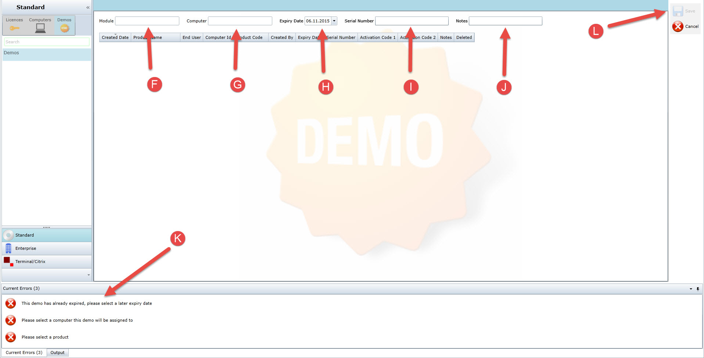** 

**F**: Select from the drop down menu the required **Module**. 

**G**: Now type in the **Computer ID** or type in the **User's Name** in the box. If the computer is not there it must be added onto the system first. 

**H**: Click on the **Expiry date** box and from the drop down calendar select a date. 

**I**: This box needs to only get filled in for an **Telephone** activated pc and not **Online** it can remain empty with an **Online** activated PC. 

**j**: This box does not need to get filled it can remain empty. 

**K**: You can check at the bottom of the page as a step by step guide to activating the **Demo**. 

**L**: Now you may click on the **Save** button to finalise the demo. 

## 

## Enterprise

In Enterprise Licensing we do not add Licenses we add the option to add new Licenses. (For Example): 

**** 

**A**: Click on the **Enterprise** tab which will open this screen for you. 

**B**: This is a list of the available modules that licenses can be added to. You can type in the search box at the top to find the relevant license you are looking for. 

**C**: Click on the **Add Product** button to add on a new module that a license can be assigned to. The following screen will appear. 

**** 

**D**: Enter the module you would like to add and a **drop down** menu will appear to help you find which one you need. 

**E**: Click on the **Save** button and now the module will be added into the search box on the left hand side of the screen. 

**** 

**F**: You can now see that the module we selected is available in the **search box menu.** 

**G**: On the right hand side if you select **Adjust total users** you can now add to the modules and give them licenses. 

**** 

**H**: Here you get the option to choose how many **Licenses** you want to issue from a drop down menu. 

**I**: This is the date the Licenses will be **Active** from. Normally when they will start to use the Licenses. 

**J**: Here if where you would enter the **Invoice number**. 

**K**: If an Invoice number has not been entered you can enter a **Note** instead which will also give you the option to activate once entered. 

**L**: Now you can click on **Save** to add the users to a license. 

## 

## Terminal/Citrix
