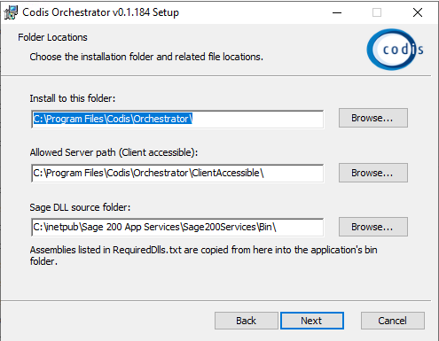
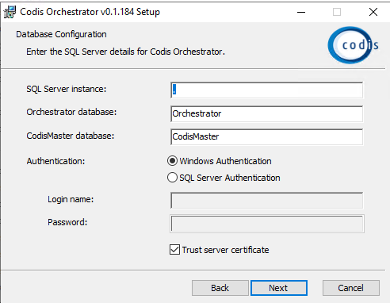
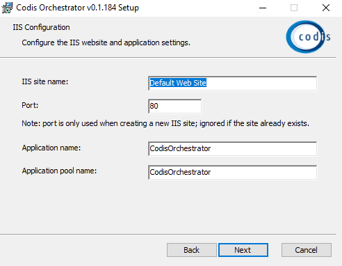
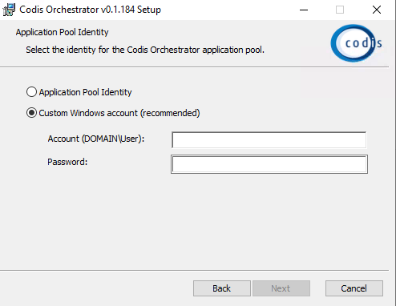

# Prerequisites

1. Enable Web Socket Protocol in Server Manager
1. Go to Server Manager \> Manage \>Add or Remove Features  

2. Go to Web Server \> Application Development  

3. Install IIS URL Rewrite:  
[URL Rewrite : The Official Microsoft IIS Site](https://www.iis.net/downloads/microsoft/url-rewrite)
4. Download and install Windows Hosting Bundle from :  
[Download .NET Core 2\.1 (Linux, macOS, and Windows) (microsoft.com)](https://dotnet.microsoft.com/en-us/download/dotnet/2.1)  

# Download and Install Codis Sage200 System Settings

1. Download from DevOps: [Pipelines \- Runs for Sage 200 Web Services](https://dev.azure.com/codislimited/CodisDevelopment/_build?definitionId=147)
2. Create new database 'CodisMaster'  

3. Download CodisMaster sql script from:   
[https://dev.azure.com/codislimited/CodisDevelopment/\_git/CodisDevelopment?version\=GBmaster\&path\=/Sage1000/V3/IP/Codis.System/CodisMaster.sql](https://dev.azure.com/codislimited/CodisDevelopment/_git/CodisDevelopment?version=GBmaster&path=/Sage1000/V3/IP/Codis.System/CodisMaster.sql)
4. Run CodisMaster.sql on CodisMaster db after updating first line:   
USE \[CodisMaster]  
  
Note: This to ensure updates are made to CodisMaster database only
5. Run Sage200CodisSystem from C:\\Program Files (x86\)\\Codis Excelerator\\CodisIP\\CodisSage200SystemSettings (standard installation directory)  

6. Enter connection details and use the SQL username which has access to CodisMaster database
7. Complete the licencing process.

# Orchestrator Installation

1\. Download Orchestrator Installer from  

> [Pipelines \- Runs for Orchestrator](https://dev.azure.com/codislimited/CodisDevelopment/_build?definitionId=145)
> 
> Artifact \> Installers \> CodisOrchestrator.msi

2\. Run the installer and define installation location and Sage DLL path

1. Allowed Server path: This is the root directory that can be browsed from Orchestrator directly (The templates are range definition folder should be there in this directory)

  
  
 3\. SQL Server Details1. SQL Connection details: Instance name \- If it's a default instance, leave it as '.', else enter the instance name
2. Orcehstrator Database: The name for Orchestrator database \- Leave it as Orchestrator
3. CodisMaster Database: Name of database created earlier for Codis System Settings
4. Defined authentication method used for connecting CodisMaster and Orchestrator. This detail will be used to save an entry in PolicyValue table in CodisMaster

  
  
4\. IIS Configuration  
1. Site Name: Name of the site under which Orchestrator will be configured, leave it as default
2. Application Name: Name of the site, this name is used to access Orchestrator via http://localhost/CodisOrchestrator/
3. Application Pool Name: Application Pool name used for the site

  
   
5\. App Pool Identity1. Define the user account which will be used for Orchestrator (Note: This account muse have Sage client installed, and have necessary permission for modules)
2. Account Name must be same as it's in licencing window (eg. AzureAD\\UserName)

  
  
6\. Finish the installation.  
**Manual Configuration:**  
1. If the installer does not copy the Sage dlls due to permission issue:
1. Go to Orchestrator folder defined during the installation process, and change permission to allow write for current user.
2. Go to Bin folder and run Codis.Sage200BinCopyUtility: This will copy necessary dlls from Sage

3. Go to ConfigData folder and update the ConfigValues.json
1. LicencedUser: UserName of the profile for which Orchestrator is running  
Note: The name from installation will be available here
2. SMTP Settigns:
1. HostName: SMTP servename (for outlook: smtp.outlook.com)
2. SMTP port (commonly 25, 465, or 587\)
3. UserName: Email address to connect to the SMTP server
4. Password for the username: Password will be encrypted when recycle the AppPool
5. SenderEmail: Email address to use for sending the emails
