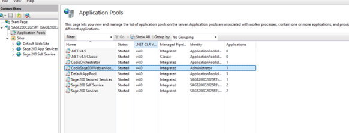
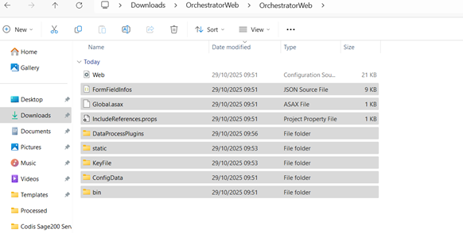
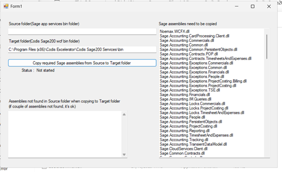
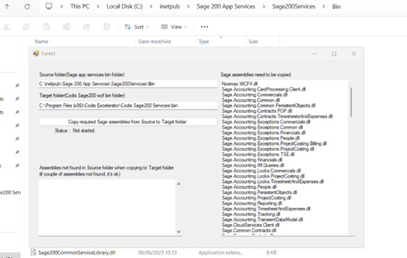
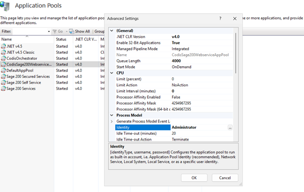
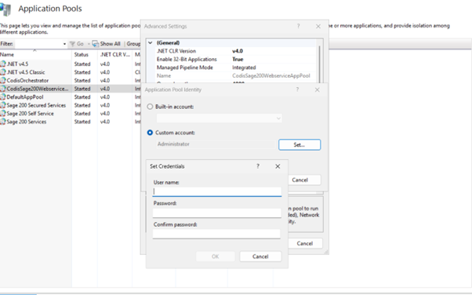

**Orchestrator Upgrade Documentation**

**Step 1: Stop Application Pools**

1. Open **IIS \> Application Pools**.
2. Stop the following application pools:
- CodisOrchestrator
- CodisSage200WebServices

   

**Step 2: Uninstall Existing Components**

1. Uninstall **Sage 200 Services**.
2. If the uninstallation fails, use a third\-party uninstaller such as **Revo Setup** to remove the component.

**Step 3: Install Required Components**

1. Install the latest versions of the following from their respective pipelines:
- Sage 200 Services

**Step 4: Update Orchestrator Files**

1. After downloading the Orchestrator package, open the folder:  
 OrchestratorWeb \> OrchestratorWeb \> DataProcessPlugins
2. Delete all folders except **Codis**.
3. Copy all files (excluding **Web.config**) into the existing **OrchestratorWeb** folder.

****

**Step 5: Update Web.config Settings**

1. Navigate to:  
 C:\\Program Files (x86\)\\Codis Excelerator\\Codis Sage200 Services
2. Open the **Web.config** file.
3. Locate the server name and replace it with the current hyper's server name (e.g., **SAGE200C2025R1**).

**Step 6: Copy Required Sage Assemblies**

1. Go to:  
 C:\\Program Files (x86\)\\Codis Excelerator\\Codis Sage200 Services\\bin
2. Locate the **Codis.Sage200\.WCF.Utility** application and run.

  
3. Then open:  
 C:\\inetpub\\Sage 200 App Services\\Sage200Services\\Bin
4. You have the utility running in the background and:
- Paste the **source location**(Step 3\).
- Click **Copy Required Sage Assemblies from Source to Target Folder**.

                 

**Step 7: Update Application Pool Identity**

1. In **IIS Manager → Application Pools**, locate **CodisSage200WebServices**.
2. Right\-click and select **Advanced Settings**.
3. Under **Process Model → Identity**, update the credentials as required.

Username: Administrator

Password: Admin123

   

   

****

**Step 8: Final Verification**

1. Restart the following application pools in IIS:
- CodisOrchestrator
- CodisSage200WebServices

3. Verify that the Orchestrator service is running without errors.
4. Open the Orchestrator URL in a web browser to confirm access.
5. Check the **Windows Event Viewer** and **IIS logs** for any errors or warnings.
