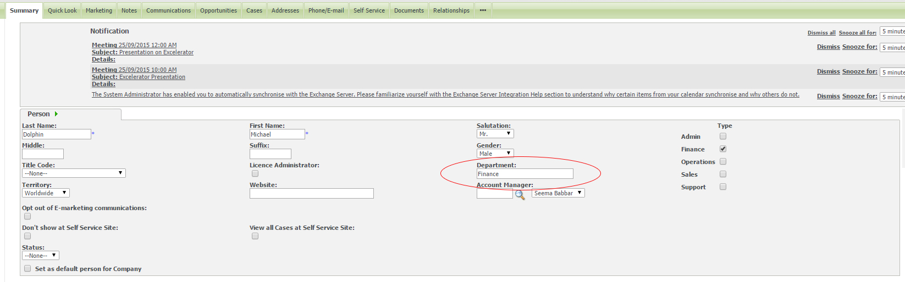

**This page explains the process of sending out Excelerator price increase letters to our customers. It assumes knowledge of [Swift Page](Swift Page.md), which is used to create letter templates.** 

## Customer groups

The letters will need need to be sent to direct customers and resellers via e\-shot and physical form. 

These two groups are already set up in Sage CRM: 

- Direct Customers \- Finance \- with Addresses.
- Resellers \- Finance \- with Addresses.

These are dynamic groups that automatically pull\-in customer names and email addresses, providing the customer is set under the department Finance. If you need a person to appear in this dynamic group, you will need to set their department to Finance in the customer record: 

 

The groups should be checked for the following: 

- That they do not contain people who no longer work at the organisation.
- Whether there are people who not present in the group and should be added.
- That all email and physical addresses are present. The physical address should state the country. This is particularly important for non\-UK countries.

## Preparing the letters

The orginal Word document letters are saved in the [Excelerator Pricing](https://codislimited.sharepoint.com/sites/Wiki/Sales/Sales%20Wiki/Documents/Pricing/Excelerator%20Sage%201000%20Pricing) folder. 

Log in to [Swift Page](Swift Page.md) and click Template Editors. Browse to the Global Templates tab and locate the price change templates. They will be called as follows: 

- Price change increase direct YYYY ("YYYY" is the year the letters were sent. Please locate the most recent year).
- Price change increase resellers YYYY.

Copy each letter and change the year appropriately. Click "Edit" to begin editing these letters. Here, the new prices and dates (when the price change will be in effect) should be updated. Once both letters are ready, click Save and then click Exit. 

You MUST click Exit. Simply closing your browser down will not save the templates.

## E\-shot

1. Go to Sage CRM and access the Marketing section.
2. Click the E\-Marketing tab and select New E\-Marketing Campaign.
3. Name this campaign "Price Increase YYYY" ("YYYY" should be the year the price increase is occurring) and set its Status to Active. Click Continue.
4. Add a New Wave and call it "E\-Shot".
5. Click Add New Wave Activity. Here you must select the correct group to E\-Shot will be sending to and set "Send As" as Codis.
6. Select the previously discussed template.
7. Click Save and Send.

## Physical letters

Repeat steps 1\-3 as above. 

1. In the existing E\-Shot Wave, click Add New Wave Activity and name it Mail Merge to Customers.
2. Select External Mail Merge for Mail Type.
3. Select the correct group and click Save.
4. Click Create File for External Use and click Save.
5. Click Start Mail Merge.
6. Click Add Local Template. Select Letter for Type, Sales for Team and Sales for Category, Person for Entity.
7. Browse for the letter and click Save.
8. Click the letter file name and then click Preview Merge.
9. Click Merge and Continue.
10. Save the letter in the same folder.
