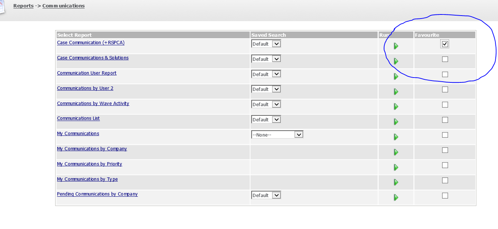

**Follow the following steps to generate the RSPCA Cases Report:** 

Please note: It is a good idea to add the report to the "My Favourite Reports" section of CRM. 

You can do this by locating the report in CRM and then ticking the checkbox under the column labelled "Favourite". 

 

**Location of Report:** 

This particular report is called Case Communication (\+RSPCA) and can be found under **Reports \-\> Communications** **in CRM.** 

The following Video shows how to run the report and export it into excel as well as inserting a pivot table. The Pivot Table will allow information contained within the report to be displayed in a more user friendly format. 

Your browser does not support html videos. 

Video for running the RSPCA report, exporting to Excel and Pivot Table.
