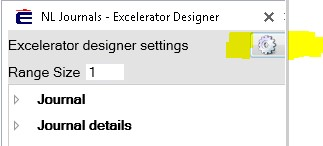
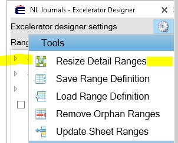
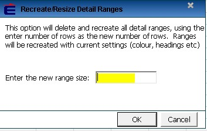

Instruction with screenshots below on how to resize ranges in Excelerator:

Within Designer tab in Excelerator, click on the cog symbol 

 **Resize ranges**

**** 

 

 

Then enter the number of rows in the box below. 

And also click on our web page link provided below:

[http://www.codis.co.uk/excelerator\-help/customise\-excelerator/design\-your\-own\-template](http://www.codis.co.uk/excelerator-help/customise-excelerator/design-your-own-template)
