1. Open SQL Server Management Studio (SQL Server Management Studio v17\.9\.1 example shown below).  
 Right\-click on Databases and select **Import Data\-tier Application**.  
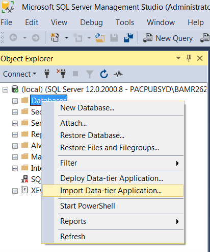  
  
You will see the below screen. Now, click Next.  
 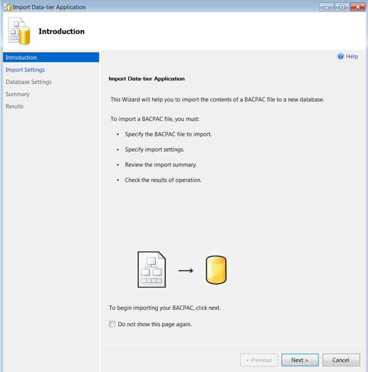
2. Click on Browse and select the. bacpac file you downloaded from Azure in the previous step and click Next as shown below –  
 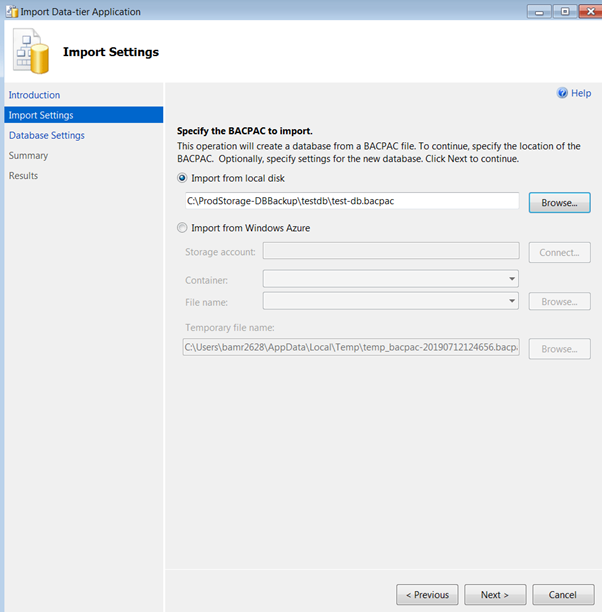
3. Here you can change the database name or can keep the same name as the .bacpac file. You can leave the other settings as it is and just click Next again.  
 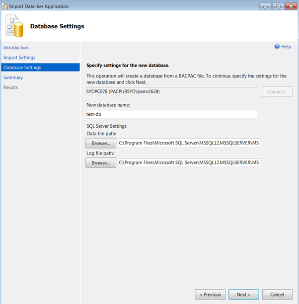
4. Verify all the settings below and click Finish or click Previous and go back to the previous settings if you want to change anything.  
 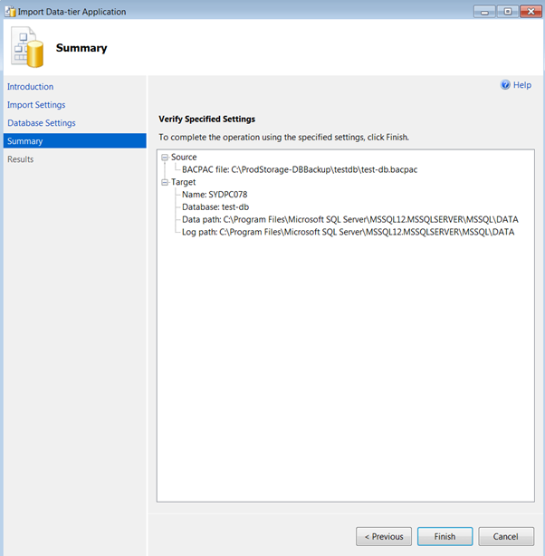
5. You will see the progress and once it is finished, you will see the below Operation Complete screen. If there is any error, you can click on that and see what is wrong, else you will get all Success  
 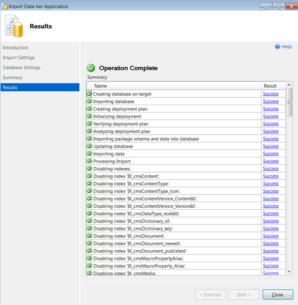
6. You can see the newly restored database under the Databases folder.  
 **Note:** If you just want to restore the .bacpac database then its all done now, and you can skip the remaining steps.  
 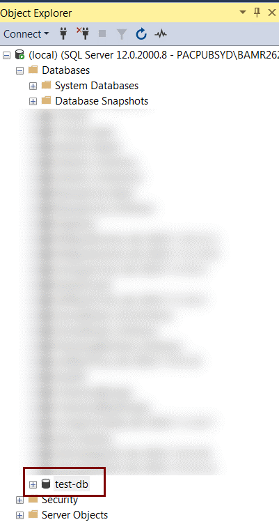
7. The next step is to create the **.bak** file.  
 For this, right\-click on the new DB and select Tasks \-\> Back Up… as shown below –  
 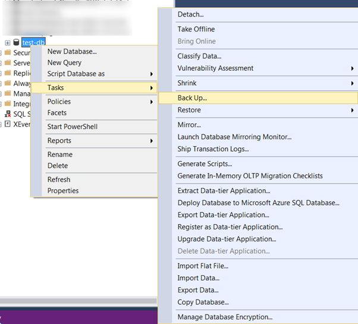
8. Now, you will see the below screen.  
 Remove the destination path that is pre\-selected by clicking Remove as shown below.  
 And then click on Add to select the path where you want to store your .bak file.  
 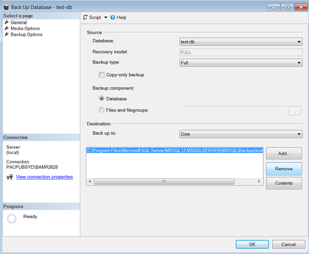
9. After clicking on Add, you will see the screen below.  
 Select the destination path/folder and add the desired File name. I have added TestDB12072019\.  
 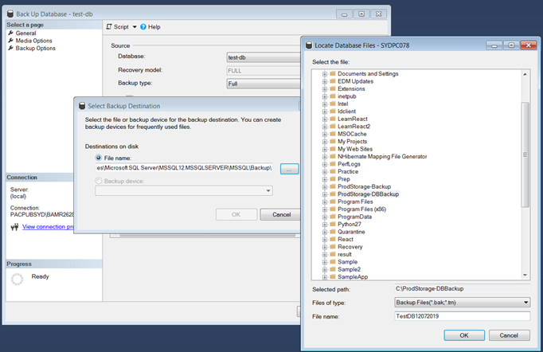
10. Click OK and you will see it executing. Once 100% completed, you will see the following screen –  
 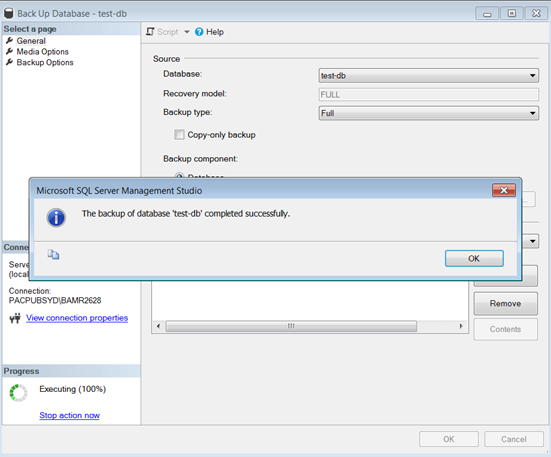  
  
Thats's it! You have created SQL Server .bak file from Azure database .bacpac file.  
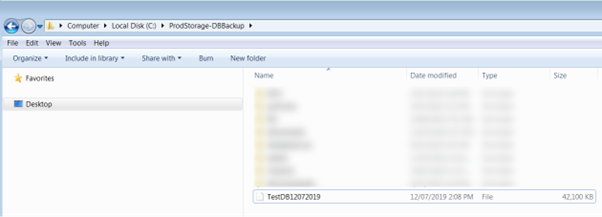
