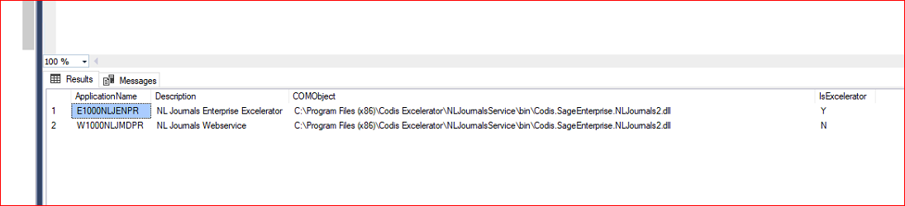
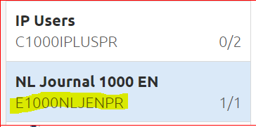

If installing S1000 web services, please following the Codis IP installation instructions: [Implementation of Codis IP V3\.aspx](Implementation of Codis IP V3.md)  

Make sure the database table \<dbo.application\> looks like the below  

The first entry(with Enteprise licence code) in the \<dbo.application\> table is created by the specific wcf service you install. Make the second entry manaully which has Web service licence code. Below example is given for NLJournal.  

  

For licencing the wcf service when used inside Orchestrator, We licence the Web service licence code only, not the Enteprise licence code as we pass the Web service licence code to wcf service call in request headers.  

  

NOTE : Below information is for some old installations/clients when wcf service was used with Excelerator which is unlikely now. For those installations, we used to licence the Enterprise licence code, not the web service licence code.  

\-\-\-\-\-\-\-\-\-\-\-\-\-\-\-\-\-\-\-\-\-\-\-\-\-\-\-\-\-\-\-\-\-\-\-\-\-\-\-\-\-\-\-\-\-\-\-\-\-\-\-\-\-\-\-\-\-\-\-\-\-\-\-\-\-\-\-\-\-\-\-\-\-\-\-\-\-\-\-\-\-\-\-\-\-\-\-\-\-\-\-\-\-\-\-\-\-\-\-\-\-\-\-\-\-\-\-\-\-\-\-\-\-\-\-\-\-\-\-\-\-\-\-\-\-\-\-\-\-\-\-\-\-\-\-\-\-\-\-\-\-\-\-\-\-\-\-\-\-\-\-\-\-\-\-\-\-\-\-\-\-\-\-\-\-\-\-\-\-\-\-\-\-\-\-\-\-\-\-\-\-\-\-\-\-\-\-\-\-\-\-\-\-\-\-\-\-\-\-\-\-\-\-\-\-\-\-\-\-\-\-\-\-\-\-\-\-\-\-\-  

Instead of webservices license (W1000NLJMDPR) please assign En NL Journal license (E1000NLJENPR) in CRM.  

  

Add/register licenses in system settings.  

  

Ask the user/customer to send E1000NLJENPR as the product in the request code.

\-\-\-\-\-\-\-\-\-\-\-\-\-\-\-\-\-\-\-\-\-\-\-\-\-\-\-\-\-\-\-\-\-\-\-\-\-\-\-\-\-\-\-\-\-\-\-\-\-\-\-\-\-\-\-\-\-\-\-\-\-\-\-\-\-\-\-\-\-\-\-\-\-\-\-\-\-\-\-\-\-\-\-\-\-\-\-\-\-\-\-\-\-\-\-\-\-\-\-\-\-\-\-\-\-\-\-\-\-\-\-\-\-\-\-\-\-\-\-\-\-\-\-\-\-\-\-\-\-\-\-\-\-\-\-\-\-\-\-\-\-\-\-\-\-\-\-\-\-\-\-\-\-\-\-\-\-\-\-\-\-\-\-\-\-\-\-\-\-\-\-\-\-\-\-\-\-\-\-\-\-\-\-\-\-\-\-\-\-\-\-\-\-\-\-\-\-\-\-\-\-\-\-\-\-\-\-\-\-\-\-\-\-\-\-\-\-\-\-\-
