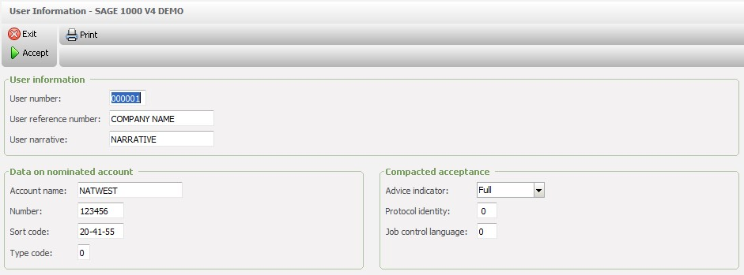
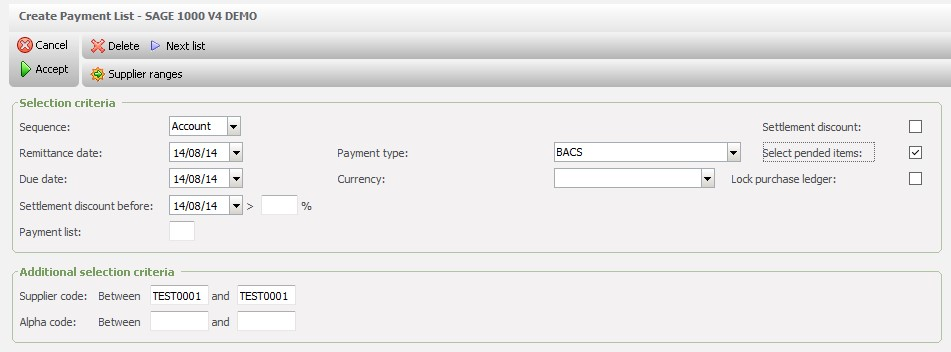
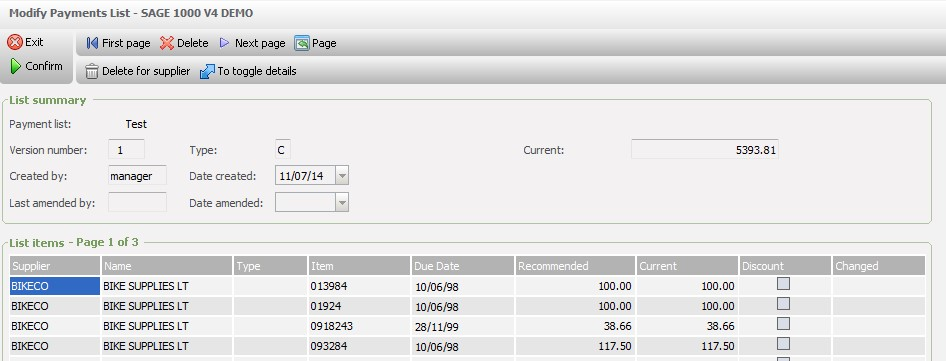
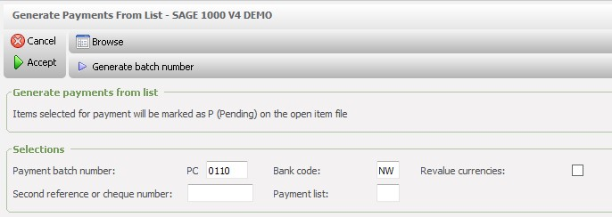
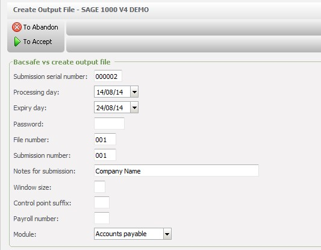
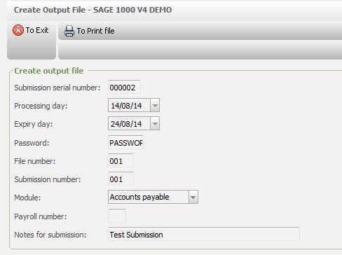
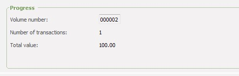
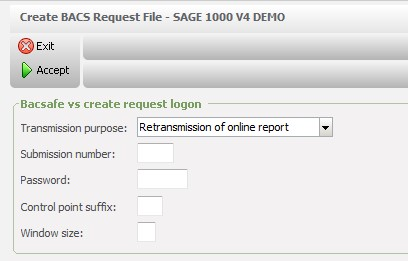

# 1 SAGE 1000 BACS SETUP

The BACS system can process transactions from Accounts Payable, Accounts Receivable and Payroll Management and convert the data into a format that can be transmitted using the BACS Telecommunications System.

This document summarises the process for generating Accounts Payable payments and the procedure to submit these payments using the Sage BACS and Telecommunications Interface.  

Please refer to the Sage Application Help for full details on the BACS and Telecommunications System Setup and Procedures.

# 2 BACS System Keys

The following is a list of the BACS system keys that are most commonly used.  Please refer to All System Keys for the full list as others may be relevant to your system.

## 2\.1 General

Set BC\_INSTAL \= YES (Is the BACS module installed?)

BA\_INSTAL\= NO (Is Electronic Payments installed?)

## 2\.2 Test Mode

BC\_TESTING \= YES (Is BACS being tested?)

## 2\.3 Live Mode

BC\_TESTING \= NO (Is BACS being tested?)

BCANYACC (this system key is used in the validation of the bank account number)

BCEMULATOR (specify the command which invokes the emulator)

BC\_BACSAFE (set to YES means to use the BACSAFE device to generate passwords)

BCCONVERT (this system key determines the format that the BACS output file is written in)

BCFREETEXT (this system key determines the setting of the free text field in the BACS output file)

# 3 BACS User Information

The BACS User Information must be entered prior to sending any BACS Submissions.

 

**User** **Number**

Enter a 6\-digit User Number uniquely assigned by BACS.  This may be left blank if the system key BCUSRNOTXT contains a 6\-digit value.  The value specified in the system key will be used instead for the submissions.  

**User Reference** **Number**

The User Reference Number is an 18 alphanumeric character field which may contain the company name.  

**User Narrative**

The User Narrative can be up to 18 alphanumeric characters.  This text appears on the user's statement which is returned by BACS in the reports.

**Data on Nominated Account**

Enter the bank account name, account number and sort code from which transactions are to be debited.

**Compacted Acceptance**

Select 'Compacted' to obtain Acceptance Advice files in compacted form or 'Full' for full form in the Advice Indicator drop\-down list.  The '**Protocol identity'** is a 2\-digit number allocated by BACS to identify the communications protocol being used.  The '**Job control language' is** a 2\-digit number allocated by BACS on the Language Connection Details form.  Leave blank if not used.

# 4 AP Create Payments List

This option must be run to create a list of proposed Accounts Payable payments.

 

**Selection Criteria**

Select PaymentType **'BACS'** in the drop\-down list.

Leave 'Select pended items'set toblank to ignore items included on a previous run of the Generate Payments from List (or Remittance Advices run).  Tick this box to include items that have been marked on a previous run.

**Additional Selection Criteria**

Enter a range of Suppliers or Alpha Codes to specify a range selection or leave blank to include all.

# 5 AP Modify Payments List

This option can be used to view, amend and re\-print the proposed payment list.

 

The proposed payment list may be deleted and recreated if necessary at this point.

# 6 AP Generate Payments from List

This option spools the Remittance Advices from the payments that are stored in the Proposed Payments list file. 

 

**Payment Batch Number**

Enter a batch number or select F6 to generate the next sequential batch number.

**Bank Code**

Accept the default bank code or enter the required bank.

**Revalue Currencies**

Tick this box if foreign currencies are to be revalued in case exchange rates have changed.  When the cash batch is posted any exchange differences will be posted to the relevant accounts.  Leave blank if currency revaluation is not required.

**Second Reference**

The second reference will be used to identify the item in Accounts Payable Transaction Enquiry and Cash Management.  The value 'BACS', for example, could be entered.  (Refer to Project DA0904 and system keys PLPAYREFB/PLPAYREFT for automatically generating sequential numbers for this field).

**Payment List**

Enter a Payment list if the system is set up to use **Accounts Payable Multiple Payments Lists** **(**project DA0467\) or**Multi\-Currency Payments**(project DA0813\).

The cash payment batch that is generated must be posted using the Accounts Payable Cash option as a BACS batch (by means of a tick box in this application).

# 7 BACS \> Telecommunications System

Once the above steps have been completed, it will be possible to produce a BACS output file using the Telecommunications System. 

## 7\.1 Create Output File

This option will create the BACS output file from the transaction file of payments generated by Accounts Payable Generate Payments from List.  The output file format is acceptable for submission to BACS by Telecommunications or via BACSTEL\-IP.  The submission details can be amended, recreated or restarted if, there has been an interruption in the transmission or if the file has been rejected.

**Live Mode Screen**

 

**Test Mode Screen**

 

**Submission Serial No** 

Enter a 6\-character unique submission serial number that is to be used to identify the submission. 

**Processing Day**

The Processing day is set to 2 days from today's date. This is the date on which BACS is to process the transactions which is normally the day after the transactions are transmitted to BACS.  Accept the default date or amend if required.

**Expiry Day**

The Expiry day is set to 10 days from today's date. This is the date when the submission can be deleted from the Past Submissions table, along with the submission and related files.  Accept the default date or amend if required.  **Do not enter a date earlier than this.**

**Password – Test Mode**

When BC\_TESTING is set to YES, the password can be 7\-characters of free text.

**Password – Live Mode**

A password must be entered in order to provide unique protection for each transmission.  It is possible to use BACSAFE if the system key BC\_BACSAFE is set to YES.  A password can be generated using a handheld BACSAFE device or manually entered if issued by a sponsoring bank.

The password issued by the sponsoring bank is a 7\-character string.  The password generated through BACSAFE is a 5\-digit number.

The following fields must be completed if using BACSAFE.  (Note, if the following fields are not displayed and the password allows entry of 7 characters then, the system is running in **Test Mode**).

**Control point suffix**

This is a 2\-digit control supplied by BACS.

**Window size**

This is the number of passwords that can be entered in the 'Password window size' in the Submissions program.  Enter a number between 5 and 20 (inclusive), 0 (zero) or leave blank.

**File Number**

Enter a 3\-digit file number that will be used to identify the output file used in this submission. Each submission processed on any particular day must have a unique number.

**Submission number**

Enter a 3\-digit submission number that will be used to identify the submission.  Each SEND transmission made on any particular day must have a unique submission number. This number can be re\-used on the same day for ENQUIRY and PRINT request transmissions, or for a RESTART transmission.

**Payroll**

This can be left blank as it is not be used.

**Module**

Select Accounts Payable from the drop\-down list.

**Notes for Submission**

Enter the notes for the submission (up to 37 alphanumeric characters) to identify the contents of the submission.  These are displayed for reference by the option List Past Submissions.  This is the reference that is shown on the supplier's bank statement.

The following boxes are only displayed if system key BC\_BACSAFE is set to NO and the system is set up to use IBAN SUPPORT (refer to the Application Help for full details).

**New line for each record**

Tick this box to print a new line at the end of each record in the output file.  Leave blank if this format is not required.

**Print END line**

Leave this box ticked to include an END line in the output file.

After entering the details, select Accept and the following screen will be displayed.

Select F10 to print the payments and to reconcile the totals with Accounts Payable.

## 7\.2 Submit Files to BACS

This program invokes the emulator command and transmits a BACS Output file that has been created or re\-created by the Create Output File or the Re\-create Output File options.

The command for invoking the emulator software must be set up in the system key BCEMULATOR before an Output file can be transmitted.  The file to be transmitted is called bcnnnnnn.OUT, where nnnnnn is the submission serial number, for example, bc000001\.OUT.  The output files are located in the company directory folder.

**Refer to the documentation supplied with your emulator software.**

Once the BACS output file has been transmitted, BACS returns a report indicating either acceptance or rejection of the file.  If rejected, create a BACS Request Output File and send it via the emulator to locate the position of errors in the data.   If a copy of the on\-line report is required, create a PRINT request using the Create BACS Request File option (see below).   

## 7\.3 Create BACS Request File

This option creates a BACS request output file for transmission in the same way as a BACS output file.   It can be used to request Information relating to any errors when a file has been rejected.

There are two types of request: 

- Retransmit the online report for a previous transmission on the same day
- Determine the point of failure of an interrupted transmission

The following screen is displayed when BC\_TESTING is set to NO.

 

**Transmission Purpose**

Select a transmission purpose from the drop\-down list.

**Submission Number**

Enter the submission number that has failed or been rejected.

**Password/Control Point Suffix/Window Size**

As for the Create Output File option.

## 7\.4 Restart Submission

This option allows the BACS output file to be restarted after an interruption in a transmission.

## 7\.5 Amend Past Submissions

This permits transactions within a submission to be amended that have been rejected by BACS because of errors in the data.

The transactions cannot be re\-sent to BACS because their status is set to 'Sent'.

It is possible to amend the account number and sort code of an individual transaction.  The transactions can be remarked by setting the status to 'Ready to Send' to be resubmitted by BACS.

The status of transactions can be set to 'Hold', if payments are made by another method.

Accepting the transactions in a submission allows the submission to be deleted by the Delete Past Submissions option.

## 7\.6 List Past Submissions

This option generates a report, listing all past submissions that have not yet been deleted from the Past Submissions file.

## 7\.7 Delete Past Submissions

This option allows the BACS output and submission files to be removed from the Past Submissions table.

The BACS system can only store a maximum of 99 submissions. Submissions should be deleted as soon as they have been accepted by BACS and the reports returned.  Note that a submission can only be deleted from the Past Submission file when both of the following conditions apply:

- Each transaction within the submission has been either accepted by BACS or suspended by the user.

An input report relating to the submission has been received from BACS.
