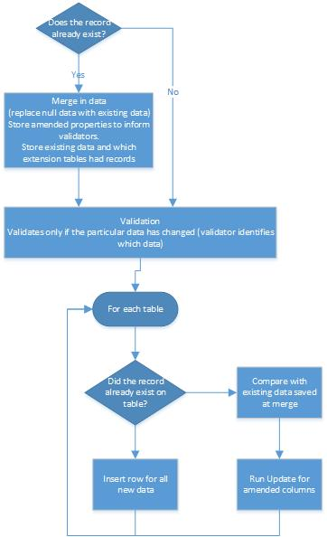

**This page describes the architecture used in Sage 500/1000 Master APIs and is intended for use by Developers. Master APIs are APIs that update master tables.** 

## Overview

A Sage 1000 Master API usually has to have the follow functionality: 

- A list of DTOs holding master data has to be processed. The DTOs may not hold complete data.  Where a data field is not being updated, that DTO property should be null (nothing).
- Data in this list has to be compared with existing data. Only changed or new rows should be saved to keep maximum concurrency and performance.
- Where a row already exists, an update should be used that only updates amended columns of data.
- All data should be validated before saving.  Invalid data should not be saved.  Note that validation can depend on other combinations of data fields and that data can changes as a result of validation.

## Base classes and Interfaces

### MasterRecordAPI

An abstract base class for APIs. This class provides a structure for processing the list of MasterRecordDTO. It expects a list of validators to be defined in a validator group named ItemValidationList. These validators should validate the master data. MasterRecordAPI relies on a MasterRecordExistsValidator validator being run that will set whether the record has changed and merge in existing data. 

Note: There may be cases where you want to validate if a value is nothing or not. The merge process in the MasterRecordExistsValidator will replace null values with existing values when the record exists. In these cases, the validator that checks the nothing value should appear in the ItemValidationList before the MasterRecordExistsValidator 

### MasterRecordExistsValidator

An abstract class that will: 

- Reads to see if the data already exists.
- If the record exists, compares the new data with the existing data, merging in existing values where null values are on the new master record DTO.
- Sets properties on the MasterRecordDTO to indicate whether the record exists and whether the DTO contains changed data.

### MasterRecordDTO

An abstract base class of the individual master data DTOs. It: 

- Defines a key for reading a record .

### MasterRecordBaseDTO

An abstract base class that holds the list of master data DTOs 

### IMasterRecordDAO

An interface that provides DAO methods that are required by MasterRecordAPI and MasterRecordExistsValidator. 

### MasterDBHelper

Helper class used by the DAO to simplify the mapping of the business layer to the database layer (see below). 

## Mapping of the Business Layer to the Database layer

### Background

The mapping of the logical business layer entities to the database layer is a challenge for all Sage 500/1000 modules.  The database layer is often fragmented and reflects the software's age, so the business layer should not directly represent it, but should present a sensible design for consumption by its clients.  Because of this, some sort of translation layer is required.

Unlike the transactional batch tables, master tables tend to have a single database field on a single row that maps to a business layer data field.  However, these fields are spread across multiple tables (a base and extension tables).  Also, there was a decision to have hard codes properties to hold business layer data (to get the benefits of strong typing) years ago and the limitations of Visual Basic meant that there was no attempt to make any easy generic mapping between business layer and database fields.

Another complication is that there are tables that are only populated and fields that change name, or are merged or don't exist, dependent on configuration (usually project configuration).

### Solution

To deal with these in a way that doesn't require the extensive refactoring needed for converting hard codes properties to a soft coded structure, we've introduced bindings to tie DTO hard properties to database fields.  These relationships have been in the code since the VB days, so we can convert that code into more easy to use from\-to relationships in a way that should be safer than any manual typing.  The best place to specify this relationship would be on the DTO property itself using the DTOField attribute, but this conversion would be difficult, so instead we create methods that generating list of the bindings.

Having bindings between properties allows us to introduce generic processing for populating DTOs when reading, inserts and updates.  If the fields with changed values are tracked, the update generic processing can execute an SQL update statement using columns limited to those that have changed values.  The generic read can track which tables (base and extensions) have records for a given key, and this information can be used to determine whether an insert or update is executed for that particular table.

### Application

 

For a module:

Create a new MasterDBHelper sub\-class

- Inherit MasterDBHelper
- Override  Protected Overrides Function CreateDTOToDBBindings() As DTOToDBBindings to add the bindings.  (When an insert is performed, all DTO Properties with the DTOFieldAttribute bindings are used, so each of these properties must have binding specified.  This is a useful safety check.  If no database should be populated, then the appropriate binding mode should be used.)   Binding information consists of:
- A list of bindings per table.  Each list is associated with a table name.  Each binding can consist of:
- The dto property name
- The database field name
- Binding modes.
- None \= 0 \- No special features
- OneWay \= 1 \- Only for populating the DTO
- OneWayToSource \= 2 \- Only for populating the DB.  This can be useful where you want to have special
- TwoWay \= 4  \- Two and from the database (default)
- InActive \= 8 ' Database field inactive in this configuration
- IsMissing \= 16 ' Database field does not exist in this configuration.

- ConversionBinder. This can be an instance of a class that impments two functions: one to convert values when reading from the database and one to convert before saving.  When saving, the type of the new value will be used to find the type of the SQL parameter.

- SpecialTableProperties.  These are used to decide if a table should not be processed when saving.  (Might have to review why it does not apply to reading as well). (Although it uses DTOBindingMode, only IsMissing and InActive have any impact, and both have the same effect.)  Note that there are instances where individual fields are missing or not used based on configuration.  There are also instances where entire tables are not processed due to configuration.

- Override Protected Overridable Sub AddParamsForBinding(dto As TDTO, binding As DTOBindingField, newValue As Object, propAttrInf As PropsAndAttributesDTO, isNew As Boolean) to alter how bindings are used for inserts to allow special processing such as conditional merging of properties into database field names.
- Override  Protected Overrides Sub CopyFieldToDTO(propAttrInf As PropsAndAttributesDTO, dto As Object, nullreader As NullMappingDataReader, tempObjectStack As List(Of String)) to alter how the bindings are used to populating a DTO property.
- Override Protected MustOverride Function UpdateWhereCondition(tableName As String, masterTableDTO As TDTO, paramsForChanges As MasterTablesUpdateResults) As String to provide the where parts of the update SQL statements.  This is mandatory.

In MasterCodeDAO

- Implement CreateDBHelper to create an instance of your new MasterDBHelper sub\-class
- Change the read to use the PopulateDTO method of the dbhelper to populate the DTO.  This can be called from RowMapper classes if an instance is passed.  Or just use the default  DTOMapper which is now the default created by CreateMapper in MasterCodeDAO.
- If there are tables that don't fit into this pattern for saving then you can override InsertRow and UpdateRow, call the base method and then process the table when the tablename parameter \= MasterTableName to ensure it only processes once. (e.g. stockbinDAO write in StockDAO)
- Override SaveThisTable to prevent a table being saved based on the current data being processed (as opposed to the SpecialTableProperties, whichi is configuration based).  E.g. stock \- whether to save sttechm is

### Assumptions

### Caveat and Complications

The complication of having cache binding information being configuration based has been solved by placing the cache in the configuration lifetime cache.
