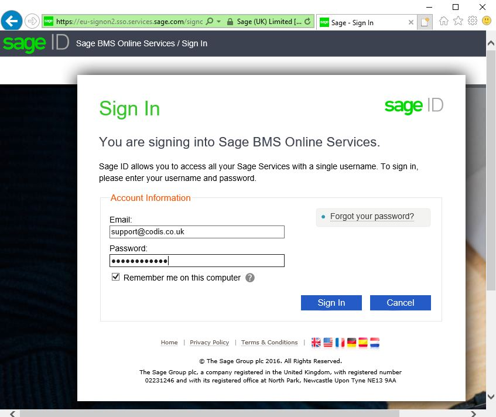
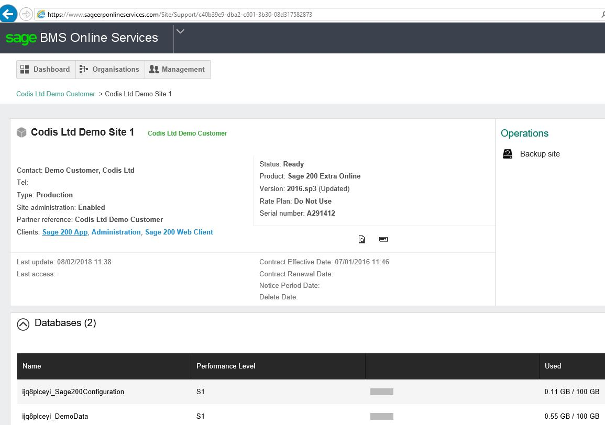
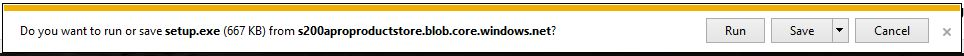
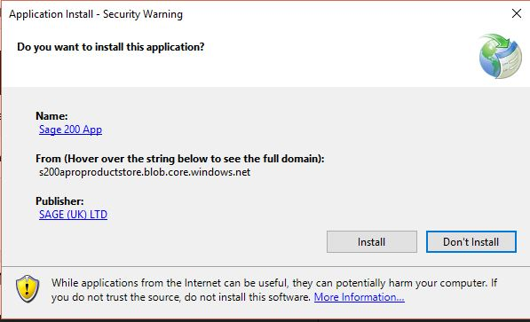
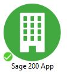
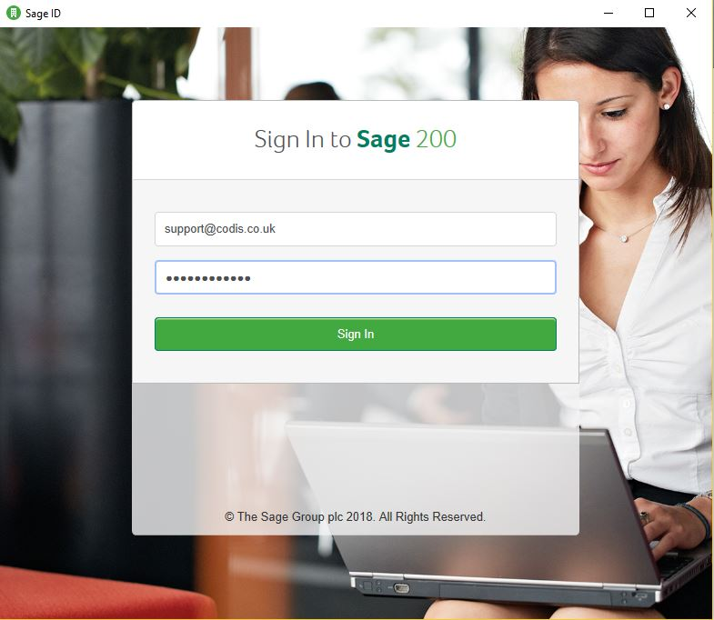
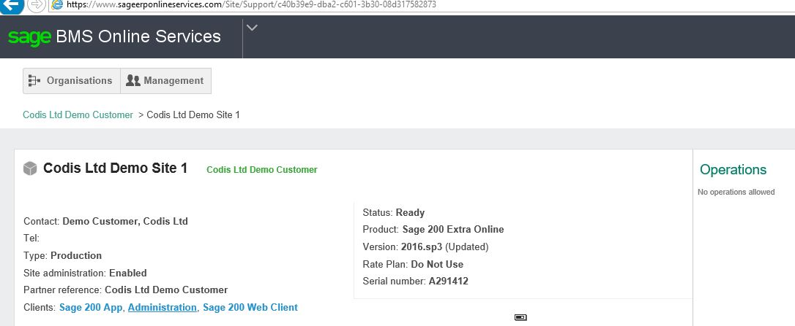
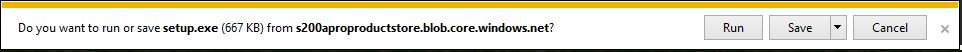
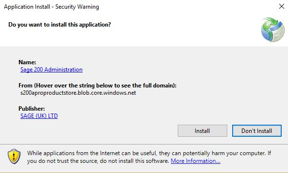
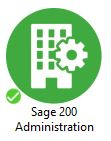

## 1\. Logon to Sage ERP Online Portal

 Logon to [**https://www.sageerponlineservices.com**](https://www.sageerponlineservices.com/) with **User's Sage ID**.

 

## 2\.  Install Sage 200 Extra Online Client App

Click on the **Sage 200 App**

 

### 1\. Run setup.exe by Clicking the Run Tab

 

### 2\. Click on Install Tab

 

### 3\. Access Sage 200 Extra Online Client App

Sage 200 Extra Online Client App is all installed now and can be accessed by double clicking the **Sage 200 App** Icon on the User's Desktop and signing in to Sage 200 with **User's Sage ID**.

 

 

## 3\. Install Sage 200 Extra Online System Administration App

**Important Note:** If the Customer's User has been assigned **Customer Administrator** role **then only** you would see the **Administration** App also listed under Clients.

Check with the customer and if they want to access Sage 200 Extra Online System Administration from their PC. If yes, then we would need to install Sage 200 Extra Online System Administration App also. 

Repeat Step 1 if not already logged onto [**Sage ERP Online Portal**](https://www.sageerponlineservices.com/) and click on **Administration.**

 

### 1\. Run setup.exe by Clicking the Run Tab

 

### 2\. Click on Install Tab

 

### 3\. Access Sage 200 Extra Online System Administration App

Sage 200 Extra Online System Administration App is all installed now and can be accessed by double clicking the **Sage 200 Administration** Icon on the User's Desktop and signing in to Sage 200 with **User's Sage ID**.

 

 

Click on below link to follow the procedure to install Sage 200 Extra Online Codis Excelerator

**[Codis Excelerator Installation For Sage 200 Extra Online](Codis Excelerator Installation For Sage 200 Extra Online.md)**
