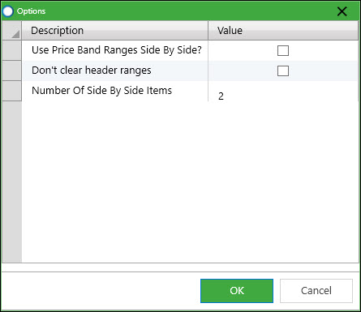

The new 2021 Sage 200 Price Bands Excelerator has the following features:  
  

- Save new or update multiple Price Bands from Excel
- Download existing Prices Bands from Sage into Excel
- Supports both Universal or Limited Price Bands.
- Browse on stock items to add them to your price list
- Use formula to apply uplifts to standard prices

# Single List and Side\-by\-Side Price Bands

There are two distinct modes for working with price bands: 

- A single list
- Side\-by\-side

In the single list format, multiple price list appear after one another in a list that goes down the sheet. This format could be useful for maintaining a single price band, imported data, or limited price bands for different set of products.  
  

| **Name** | **Description** | **Price Band Type** | **Stock Item Code** | **Stock Item
  Description** | **Standard Price** | **Price** | **Use Standard
  Price** |
| --- | --- | --- | --- | --- | --- | --- | --- |
| NewLimited | A test new limited | Limited | ABBuiltIn/15/20/2 | AB Built\-In Cookers
  Single\-Oven/500mm/White | 951\.00 | 1\.00 | N |
|  |  |  | ABBuiltIn/16/0/2x | AB Built\-In Cookers Double\-Oven/300mm/White | 953\.00 | 2\.00 | N |
|  |  |  | ABBuiltIn/16/20/2 | AB Built\-In Cookers Double\-Oven/500mm/White | 955\.00 | 3\.00 | N |
|  |  |  | ABBuiltIn/16/21/2 | AB Built\-In Cookers Double\-Oven/550mm/White | 956\.00 | 4\.00 | N |
| NewLimited2 | Another test limited | Limited | ABBuiltIn/15/20/2 | AB Built\-In Cookers Single\-Oven/500mm/White | 951\.00 | 12\.00 | N |
|  |  |  | ABBuiltIn/16/0/2 | AB Built\-In Cookers Double\-Oven/300mm/White | 953\.00 | 3\.00 | N |
|  |  |  | ABFSE/12/20/2 | AB Freestanding Electric 2\-Ring/500mm/White | 962\.00 | 4\.00 | N |
|  |  |  | ABFSE/12/21/2 | AB Freestanding Electric 2\-Ring/550mm/White | 963\.00 | 5\.00 | N |
|  |  |  | ABFSE/13/0/2x | AB Freestanding Electric 3\-Ring/300mm/White | 964\.00 | 6\.00 | N |

  
With a side\-by\-side price list, multiple price list appear side by side with the different price band prices listed in columns next to one another, with the stock items listed down one side.  This format can be useful for comparing prices in different price bands, or creating a new price band based on formulaic adjustments to an existing price band.  The example below shows a spreadsheet with two limited (see below) price bands side\-by\-side.  Note that there are blanks where the limited price bands don't have prices for that stock item.  
  

|  |  | Price Band Name | NewLimited | NewLimited2 |
| --- | --- | --- | --- | --- |
| **Stock
  Item Code** | **Stock Item
  Description** | **Standard Price** | **Price** | **Price** |
| ABBuiltIn/15/20/2 | AB Built\-In Cookers
  Single\-Oven/500mm/White | 951\.00 | 1\.00 | 12\.00 |
| ABBuiltIn/16/0/2 | AB Built\-In Cookers Double\-Oven/300mm/White | 953\.00 | 2\.00 | 3\.00 |
| ABBuiltIn/16/20/2 | AB Built\-In Cookers Double\-Oven/500mm/White | 955\.00 | 3\.00 |  |
| ABBuiltIn/16/21/2 | AB Built\-In Cookers Double\-Oven/550mm/White | 956\.00 | 4\.00 |  |
| ABFSE/12/20/2 | AB Freestanding Electric 2\-Ring/500mm/White | 962\.00 |  | 4\.00 |
| ABFSE/12/21/2 | AB Freestanding Electric 2\-Ring/550mm/White | 963\.00 |  | 5\.00 |
| ABFSE/13/0/2 | AB Freestanding Electric 3\-Ring/300mm/White | 964\.00 |  | 6\.00 |

  
To use side\-by\-side price bands, you need to activate them in the Options, and choose how many price bands you want to maintain side\-by\-side.  (Processing multiple side\-by\-side slows performance so the number needs to be limited.)  The designer will display a different range choice.  Worksheets designed for list mode will not work in side\-by\-side mode, or vice\-versa.  
  
# Universal And Limited Price Bands

These are concepts that exist in Sage 200:  

- Universal price bands are complete lists of prices.  Each one contains every stock item with an option to use the standard price instead for stock items.
- Limited price bands can be for limited time periods and/or limited stock items.  If there isn't a price for a stock item on a price band then another price band or the standard price band is used as a selling price.

Both are supported by Excelerator price bands, in both list and side\-by\-side modes.  
  
## Universal Price Bands

Universal price bands contain a record of each stock item.  If multiple new price bands are being saved, then the number of records to be saved will be number of price bands being saved x number of stock records.  Because of this Universal price bands can be slower to save and we've seen very significant improvements in performance by changing price bands from Univeral to Limited.  
  
Excelerator does support maintaining a subset of prices within a universal price band.  You can limit the items that are downloaded amend just those, and save.  Other items will be left unchanged.    
  
  
  
# Downloading Price Bands Information

  

## Download Single Price Band

  

## Download Multiple Price Bands (List)

  

## Populate Price Bands (List)

  

# Options

  

  
  
1. Use Price Band Ranges Side By Side: select this to work in Side\-By\-Side mode
2. Don't clear header ranges: if ticked, when the Clear Ranges option is selected \- header ranges will not be cleared.
3. Number Of Side By Side Items:
  
  

  

  

#
