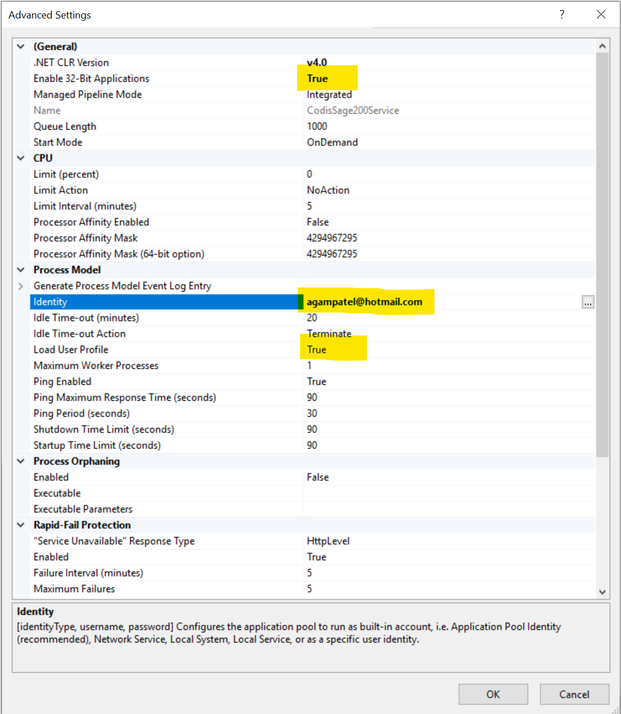

- Create new application pool
- Set "Enable 32 Bit Applications" to "True"
- Set "Identity" to custom account(User must have access to all the folders). If Sage version is 2016 or higher then sage client must be installed for the user used for the application pool identity.
- If Sage version is 2016 or higher then set "Load user profiles" to "True"

