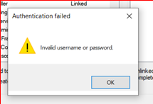

  


This is the error  


  


this could be because of API being enabled in Sage 200 administration.  


if they want to use it then they can either upgrade to a new version of Sage or follow the below to disable the api from backend  


open SQL management studio and do the following query  


  


```
--delete the entry to the API
DELETE FROM tblParameters where ParameterName = 'APISiteID'

--delete API user entries
DELETE FROM tblExtIdentity where ExtIdentityTypeID IN (1,2)

--remove any API references to existing users
UPDATE tblUser
SET isAPIUser = 0
WHERE isAPIUser = 1  

```
