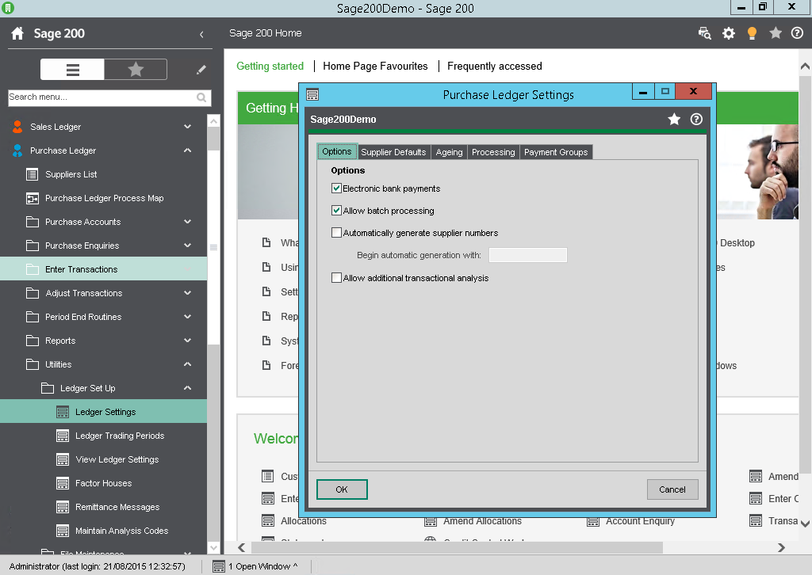
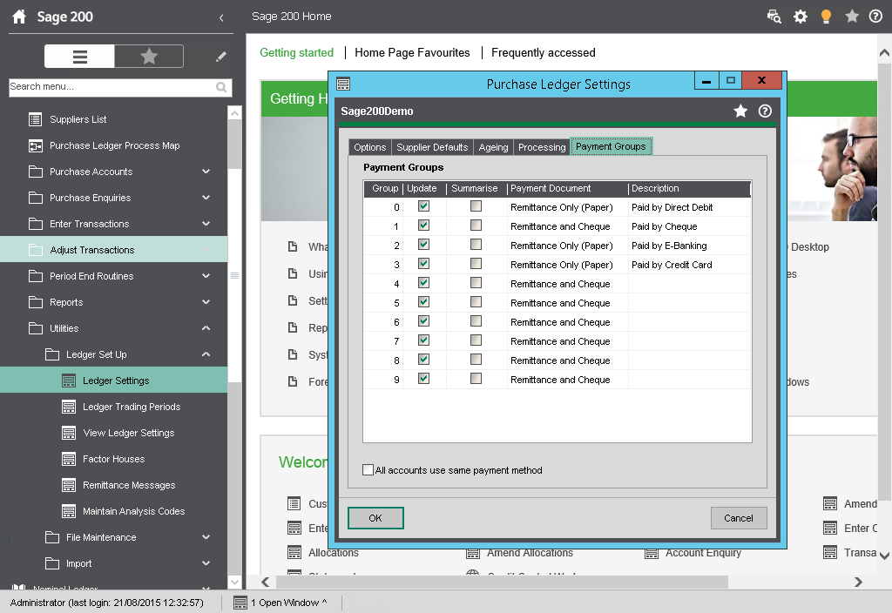
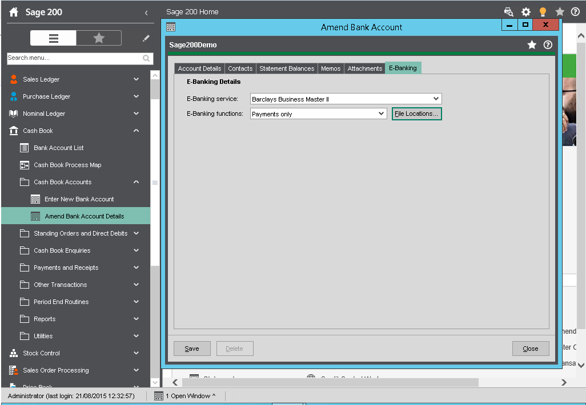

**Sage 200 e\-Banking** Sage 200 e\-Banking ( BACS )allows for integration between Sage 200 and most High Street Banks. 

## Sage 200 Configuration

### System Settings

Purchase Ledger \- Utilities \- Ledger Set up \- Ledger Settings \- Options Tab 

 

Purchase Ledger \- Utilities \- Ledger Set up \- Ledger Settings \- Options Tab 

 

### Cash Book Settings

For the bank account in question need to access the e\-Banking Tab 

 

Configure details differ depending on which bank and on which bank account type. 

### Supplier settings

There are several different Supplier details to be updated. 

1. Payment Groups
2. Bank Details
3. Email address for Remittance advises
4. Analysis Group (optional)

## Sage 200 e\-Banking Components

### Latest Components

Each Bank service has different options and may change when banks alter their procedures (file formats) when uploading payments. New formats are controlled by Sage by using a new components to be installed.   
The latest components are available for download from [https://my.sage.co.uk/public/sage\-ebanking/compatible\-banks.aspx](https://my.sage.co.uk/public/sage-ebanking/compatible-banks.aspx)   
see sage Article number 19774\. 

### Installing Components

After downloading to install the component follow the below steps 

1. Choose the correct file to download for your e\-Banking software.
2. Ensure that all Windows applications, including your Sage application, are closed. Please make sure that you keep your browser open and stay connected to the internet.
3. Select 'Run this program from its current location' if you wish to install the software now on the computer which you are using for the download.
4. When the installation has been completed, the Setup Complete screen will be displayed. Select 'Finish' to close the screen and complete the installation.   
see Sage Article number 28548

## Excelerator Up Sell

To update the large volume of Supplier information Supplier Excelerator makes a difficult, time consuming and onerous task a simple easy to use, more accurate procedure. 

## Sage 200 Undeliverable email \- Email remittance not being sent.

Click [here](Solution- Sage 200 Undeliverable email - Email remittance not being sent.md) for the solution to email remittance not being sent
