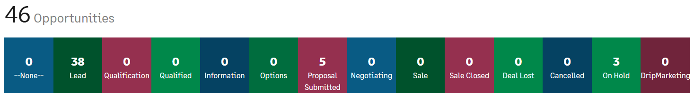

## Sage 200 support takeover pipeline

## 

1. Lead \- prospect identified/inbound (Adam with Suraj)
2. Qualification \- we know they are candidate for S200 support takeover (Suraj)
3. Qualified \- asked customer for permission (Suraj)
4. Information \- Adam getting details and preparing quote (Adam)
5. Options \- walkthrough with customer (Suraj with Adam)
6. Proposal submitted \- after walkthrough, sent proposal (Suraj with Adam)
7. Negotiating \- customer responds to proposal (Suraj)
8. Sale \- customer's a verbal yes, but yet to sign (Suraj)
9. Sale closed \- ensure paperwork all in place (Adam)
10. Deal lost
11. Cancelled
12. On hold

  
  
\-\-\-\-\-\-\-\-\-\-\-\-\-\-\-\-  
  
  
This guide explains each sales stage in Sage CRM, what it means, and the key action to progress the opportunity.  
  
Guiding question: *"**To progress this opportunity to the next stage, what's the ONE thing I can do, such that by doing it, everything else will be easier or unnecessary?**"*  
## 1\. None

What it means: No stage has been set for the opportunity.Next Action: Assign the opportunity to the right person or team who will take responsibility.  
## 2\. Lead

What it means: Someone has shown initial interest.Next Action: Contact the lead and confirm their interest in exploring solutions.  
## 3\. Qualification

What it means: Assessing if the lead is a good fit for your product or service.Next Action: Ask qualifying questions to determine if the lead’s needs, budget, and timeline align with your offering.  
## 4\. Qualified

What it means: The lead has been verified as a real opportunity.Next Action: Arrange a meeting or call to gather detailed information about their requirements.  
## 5\. Information

What it means: Gathering key details to understand the customer's needs.Next Action: Identify the key decision\-maker and their primary needs or concerns.  
## 6\. Options

What it means: Presenting solutions or options that meet the customer's needs.Next Action: Present a tailored set of solutions or products to address their needs.  
## 7\. Proposal Submitted

What it means: A formal proposal or quote has been sent to the customer.Next Action: Follow up with the decision\-maker to confirm receipt of the proposal and answer any initial questions.  
## 8\. Negotiating

What it means: Discussions are ongoing to finalise the details of the deal.Next Action: Identify the main sticking point and address it with a clear solution or compromise.  
## 9\. Sale Closed

What it means: The deal has been successfully completed.Next Action: Celebrate the success and initiate onboarding or delivery processes promptly.  
## 10\. Deal Lost

What it means: The opportunity was not successful.Next Action: Request feedback from the customer to understand what went wrong and identify opportunities for improvement.  
## 11\. Cancelled

What it means: The opportunity has been called off, often before much progress.Next Action: Confirm the reason for cancellation and explore if there’s a way to revive the opportunity.  
## 12\. On Hold

What it means: Progress on the opportunity is paused temporarily.Next Action: Set a specific date to follow up and confirm if circumstances have changed.  
## 13\. DripMarketing

What it means: Ongoing, light communication to keep the relationship warm.Next Action: Share a personalised piece of content (e.g., a case study or article) to maintain their interest over time.  
By following these steps, you can keep opportunities moving forward efficiently.
