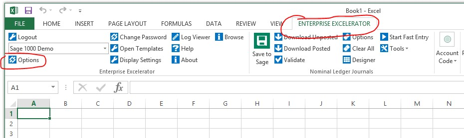
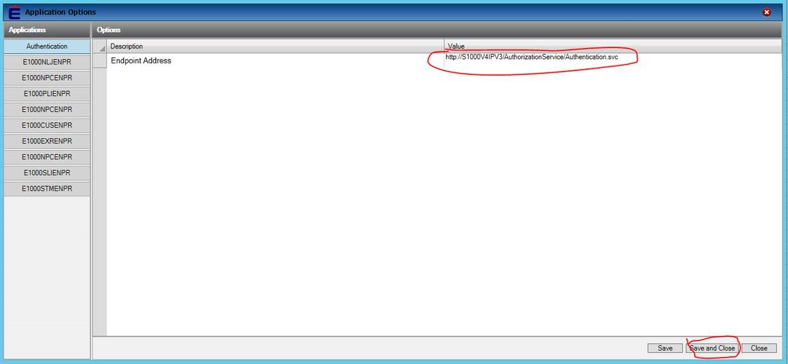

Check the endpoint value in Excelerator.

 To do so, please see the instructions with screenshots below:

1\.       Open Excel and under Enterprise Excelerator tab select Options (see below):

 

2\.       You will get window below, where you will have to enter endpoint Value, once its entered, click Save and Close. 

 

3\.       Re\-open excel and try again. If it doesn't work, copy these value from your colleague who is using Excelerator.
