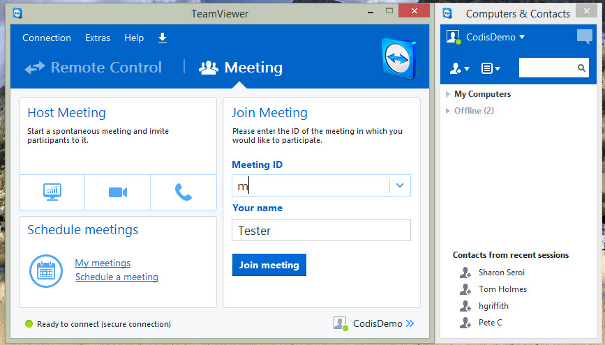

This page is for the **sales team**, when scheduling web demonstration's in **TeamViewer**. 

TeamViewer is a computer software package that is used by Codis. It is primarily used to schedule online meetings and web conferences. 

The following will show you how to schedule a meeting between an Web demonstrator and the (new) Customer. 

### 1\. Open up TeamViewer

 

### 2\. Click to schedule a meeting

### 

### 3\. Fill in the information on the dialog box

### 

### 4\. From the Dialog box that appears check if your meeting is scheduled

### 

### 5\. Fill in the information into the email dialog box that appears

### 

### 

### 6\.The meeting is scheduled

When the meeting has been scheduled you can check this in the TeamViewer list and also add this to the consultants outlook calendar.
