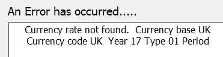
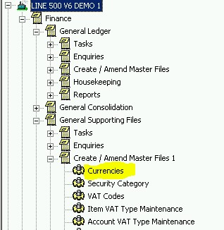
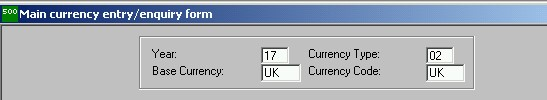

 

Each year the currencies have to be set up in Sage. You will see that  one is setup  UK  to  UK  (Type period) Year 16 with a value of 1\.

You have to do the same for year 17\.

 

 

You can press F2 to browse on currency types.
