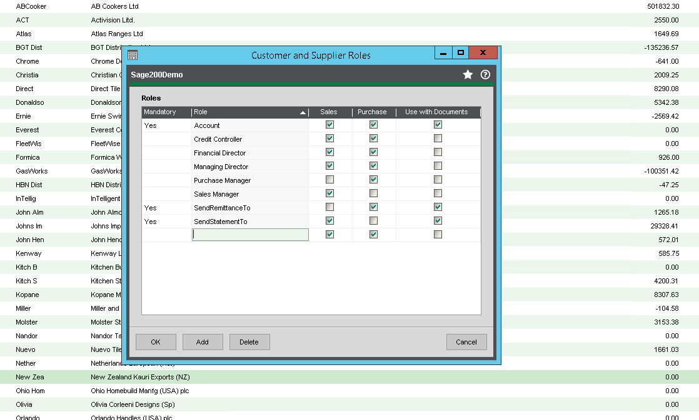
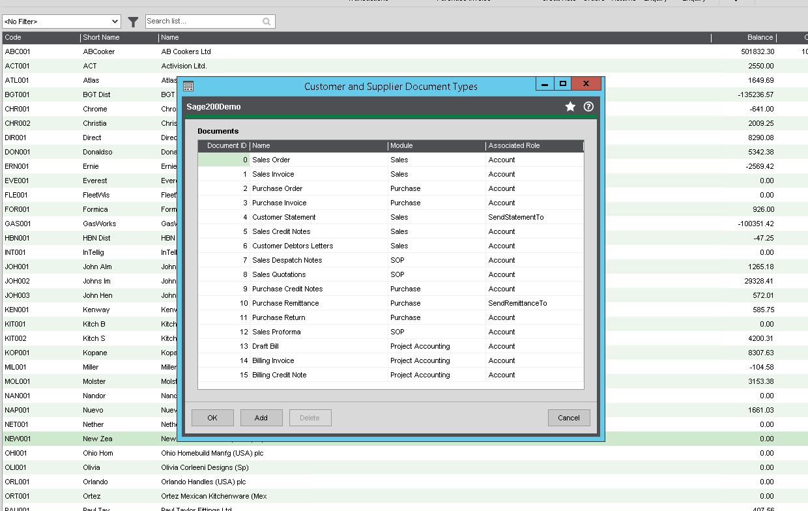
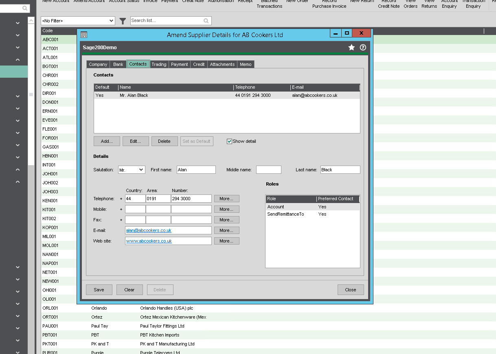
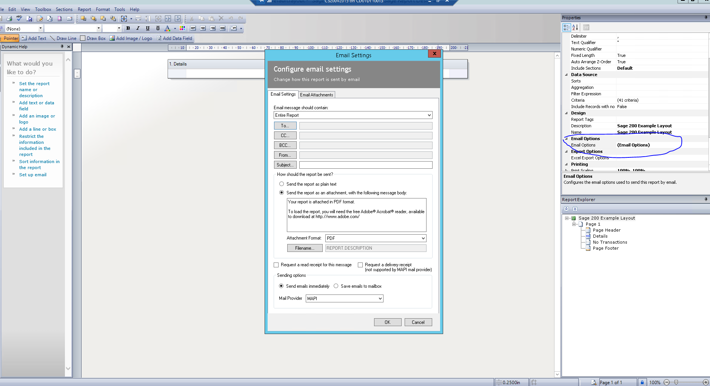

Known issue: Emailing reports \- 'Undeliverable email' and email address appears as a distribution list when sending emails via Outlook. 

The following steps should be followed to resolve this issue. 

## Customer and Supplier Roles:

Check Customer and Supplier Roles and ensure that the "Purchase" and "Use with Documents" check boxes are ticked for the mandatory role of SendRemittanceTo. 

 

## Customer and Supplier Document Types:

If you have set up roles in the Customer and Supplier Roles window, you can assign the documents that will be created for those roles. 

Ensure that the Remittance document, for the Purchase module, has the associated role of SendRemittanceTo. 

 

## Supplier Account:

In the supplier account – click the "Contacts" tab and ensure that the contacts are set up correctly. Check the contact details and the job roles. 

Ensure that the email address for the contact is correct and the SendRemittanceTo role and that the contact is set as the preferred contact for the SendRemittanceTo role. 

 

## Sage Report Designer:

Check the Sage Report Designer and locate the layout that will be used to send the remittance. 

Click on the layout. 

Select Email Options on the right hand pane and click the button to the right of the field to edit the settings. 

 

Check the settings on this page. Please note that the Mail Provider should be set as MAPI. 

## Known issue: Emailing reports \- 'Undeliverable email'

Known issue: Emailing reports \- 'Undeliverable email' and email address appears as a distribution list when sending emails via Outlook. 

**If the same document is emailed using Send emails immediately, the email sends successfully.** 

This is due to a caching issue in Microsoft Outlook. 

       Answer As a workaround, within Microsoft Outlook, ensure the Use Cached Exchange Mode check box is selected: 

**Note:** This involves making changes to your Microsoft Outlook settings. Sage cannot advise on any Outlook issues which may result from changing these settings. If in any doubt, please refer to your IT Administrator. 

•       File \> Account Settings \> Account Settings \> Change \> select the Use Cached Exchange Mode check box \> Next \> Finish. 

If the Use Cached Exchange Mode check box is not available, this is likely due to a group policy in effect on your computer and you should speak to your IT administrator to enable it. 

Alternatively, when sending emails from Sage Accounts or Sage Payroll, use the Send emails immediately option, this sends the emails immediately without saving them to your Microsoft Outlook folders: 

1\.       Sage Accounts or Sage Payroll \> select the document \> Edit. 

2\.       Report menu \> Email Settings. 

Report Designer v1\.3 and below \- Properties pane \> Email Options \> finder button . 

Tip: You can check your Report Designer version in Help \> About \> Application \> File Version. 

3\.       Email Settings tab \> Sending options \> select Send emails immediately \> OK. 

4\.       File \> Save \> File \> Exit. 

[Click here to access the Ask Sage article.](https://social.technet.microsoft.com/Forums/en-US/898ea7d0-3c72-4020-a654-ad9ee0022161/outlook-2010-imceainvalid-ndr-from-mailto-command-from-sage-50-accounts-2014?forum=outlook)
