There are two ways to merge :  

1. Using Git Commands
2. Using Git Graph in VS Code

Commands for option 1:  

git fetch \-\-all  
git checkout development  
git pull  
git checkout release  
git pull  
git merge development  
git tag \<1\.0\.4\> REPLACE THIS(1\.0\.4\) WITH THE NEW VERSION NO  
git push origin \-\-follow\-tags  
  
Steps for option 2:  
Lets take example from existing repository snapshot below.  
  
In the git graph we can see development branch is above Release branch as development is on top.  

1. Checkout development branch by double clicking on that and clicking checkout Branch and "then checkout and Pull".  
  
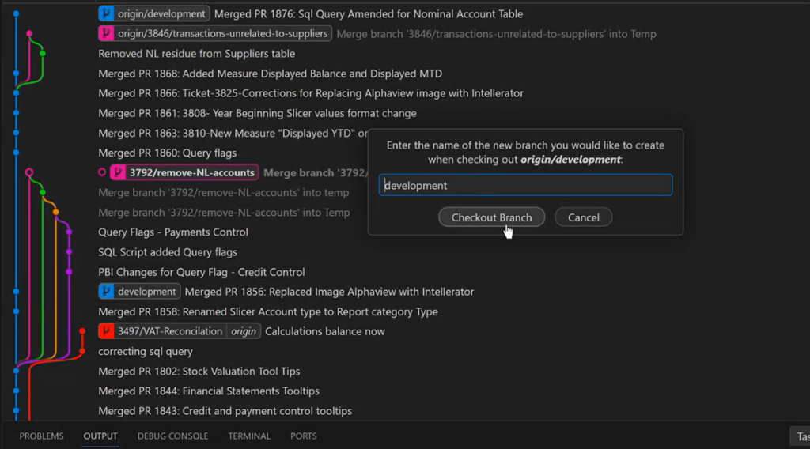  
  
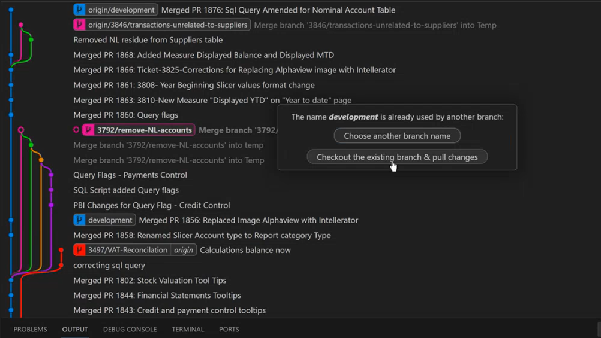
2. Fetch by clicking as shown by ble arrow in snap below.  
  
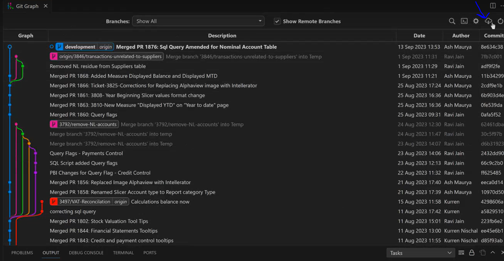
3. Checkout Release Branch with version number and sync or pull changes.  
  
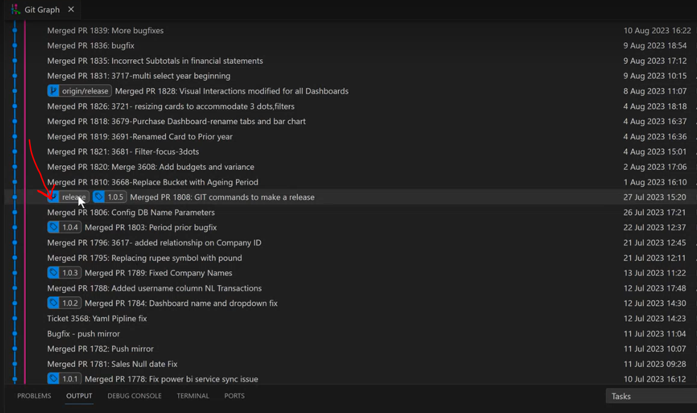  
  
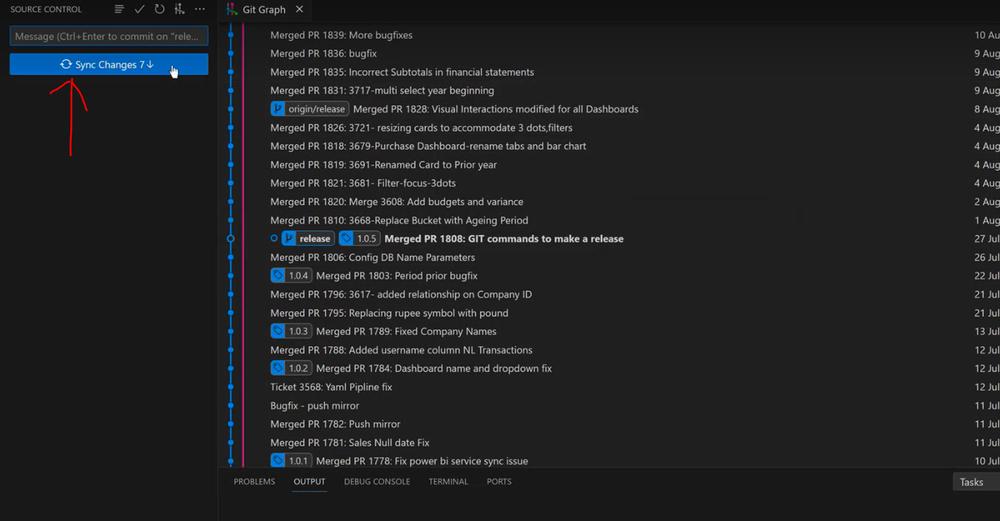  
  
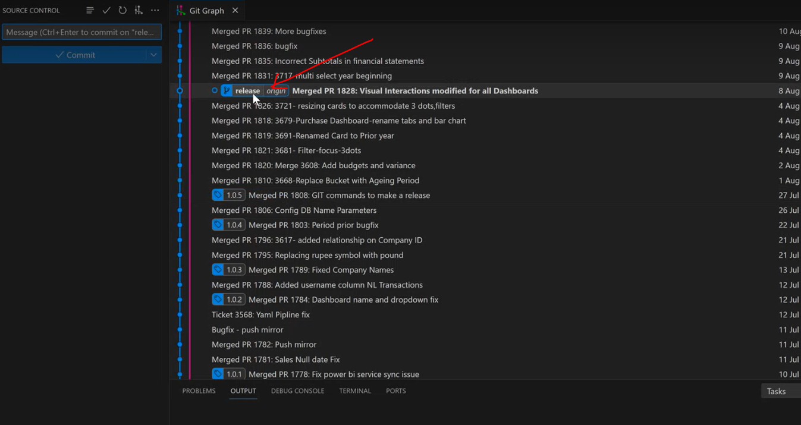
4. Add tag  
  
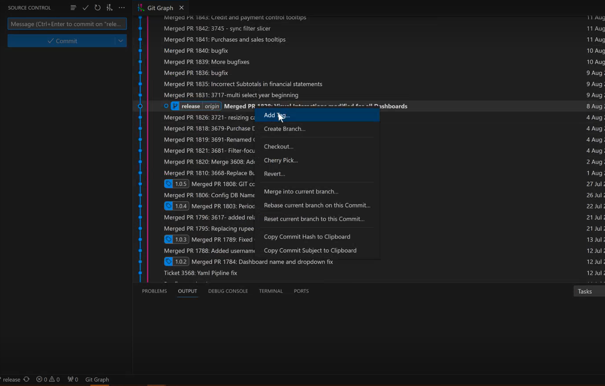  
  
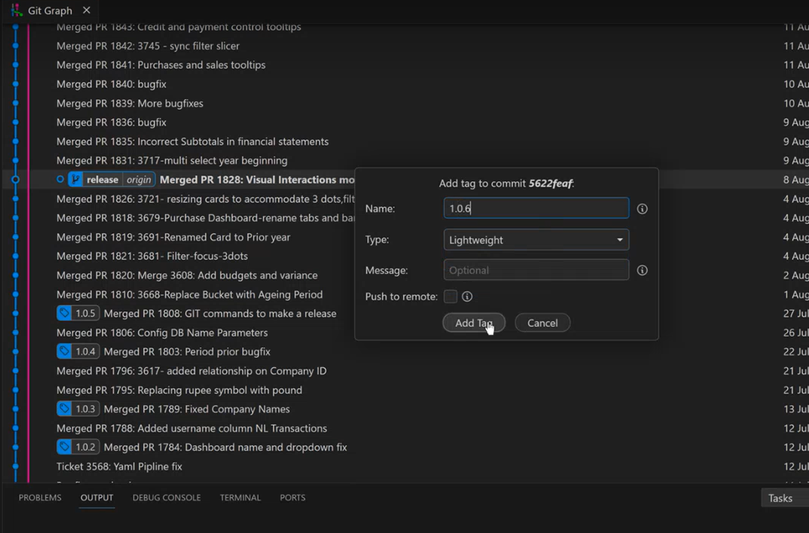
5. Merge Development Branch into Release Branch  
  
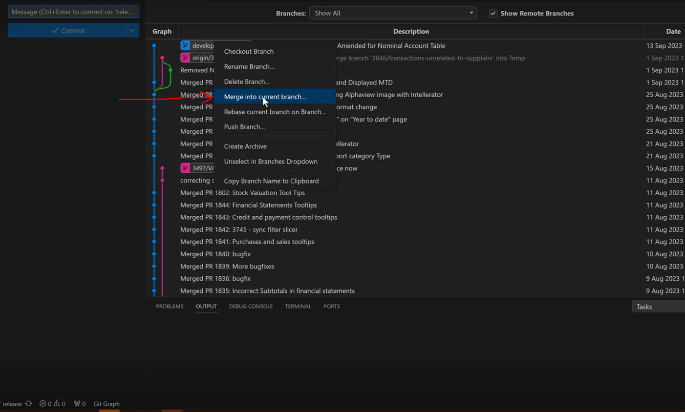  
  
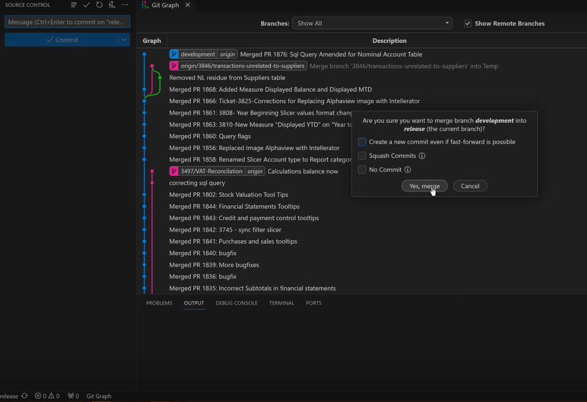  
  
You can see release branch jump next to development branch. Click Sync changes.  
  
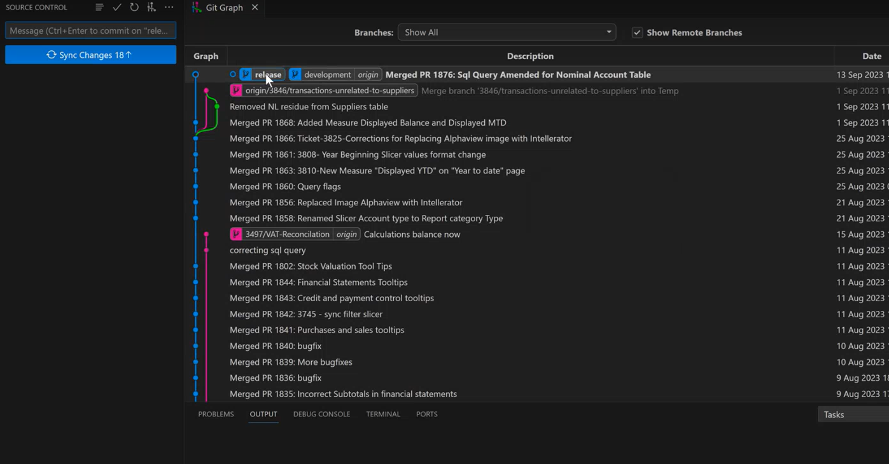  
  
Add tag as below snap.  
  
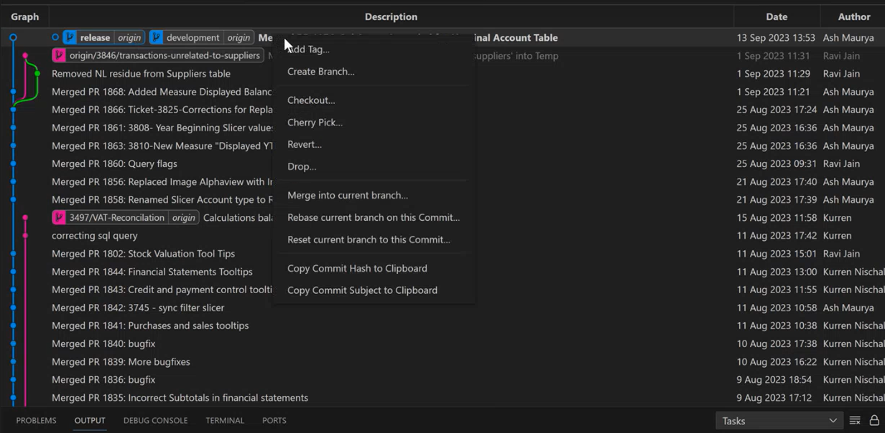  
  
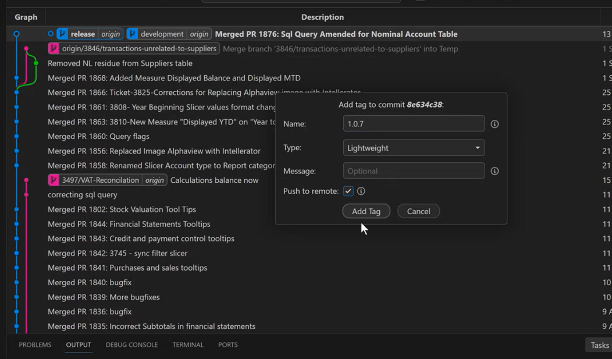  
  
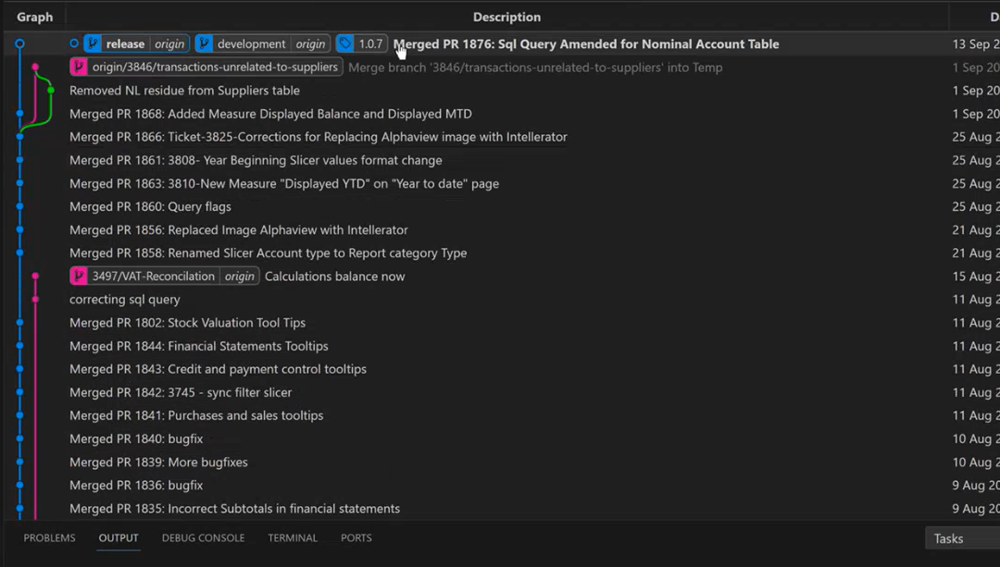  
  
Finally Development branch is Merged into Release branch.
