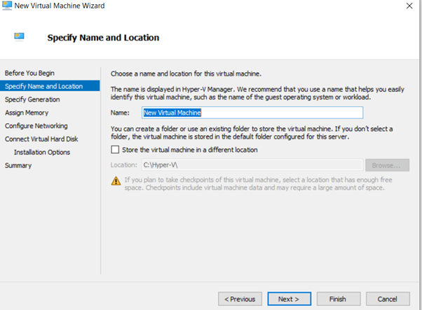
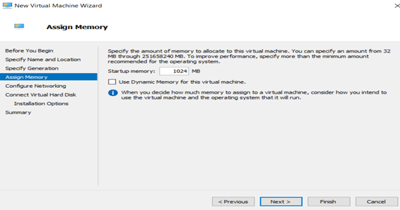
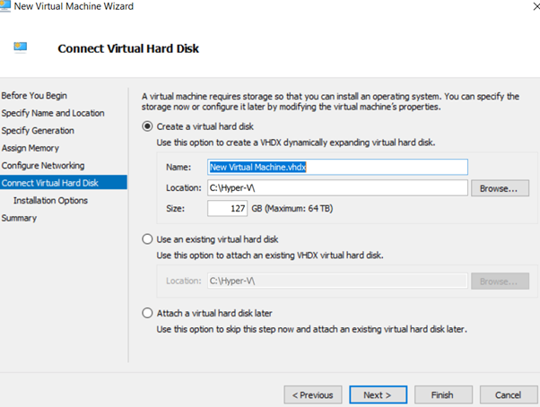
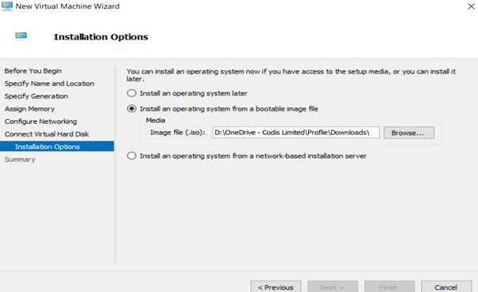
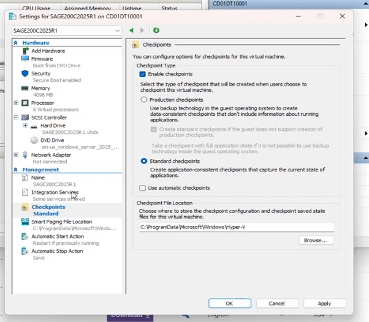
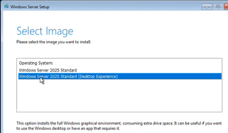

Steps to create Hyper:\- 

1. 1\. [Downloads \& Keys \- Visual Studio Subscriptions](https://my.visualstudio.com/Downloads?q=Windows%2010)
2. Download the required Windows version ISO file from above link.
2. 2\.  In Hyper V Manager: \- Actions \> New \> Virtual Machine.
3. 3\.  Rename\>Next

  
       4. 4\. Select Generation 2
5. 5\. Increase memory as per requirement, usually 4096 MB   
    Uncheck Use “Dynamic Memory for this Virtual Machine “
6. 

6. 6\. Default Switch
7. 7\. Rename same as step3 and Next
  
  
8. 8\. Select ISO that we downloaded \& Finish.
9. 
10. 
11. 9\. Once it finishes, right click on new hyper\>Settings.      Uncheck “Use Automatic Checkpoints”      In Integrated services\>check Gues services (It will allow to copy paste data to this hyper)
12. 
13. 10. 10\. Connect to the hyper and select Language and enter the key from link(step1\)Note: Used MAK key in SAGE200C2025R1 for Windows Server 2025 

	11. 11\. Select Desktop Experience

     12\. Setup the Administrator password and finish   
8.
