**SwiftPage** is an online service that the sales and marketing departments use to send e\-shots. It connects to CRM to allow emails to be sent to multiple people, similar to [mail merge](https://support.office.com/en-ca/article/Use-mail-merge-to-create-and-print-letters-and-other-documents-f488ed5b-b849-4c11-9cff-932c49474705) in Microsoft word. To send an e\-shot, an email template must first be **created** and **edited**, containing the content of the email and where any **person fields** may go (e.g. the person's title and second name). It must then be **published** so that other CRM users can use it. Finally, the template may be used in an e\-marketing activity in CRM. The following video briefly shows how to access SwiftPage for the first time, how to create a new template, edit it and publish it. For more detail, see below.

## 

## First time

These steps must be followed for the first time SwiftPage is used: 

Get an e\-marketing user ID and password from the network administrator. [Login here](http://swiftpageconnect.com/) using **Internet Explorer only**. 

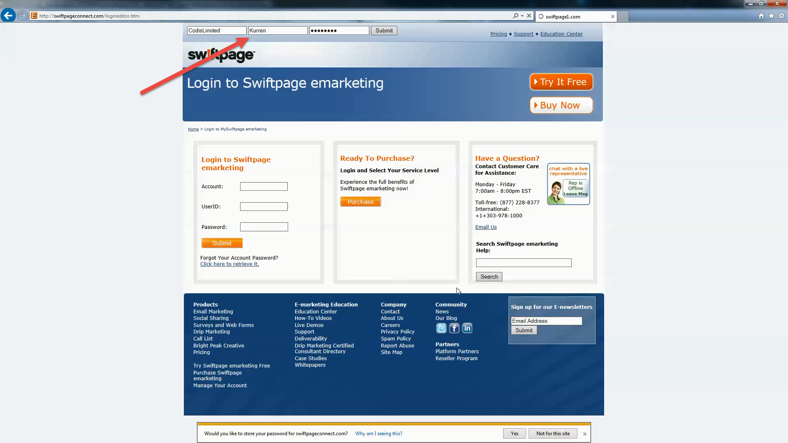 

Go to the **template editor** 

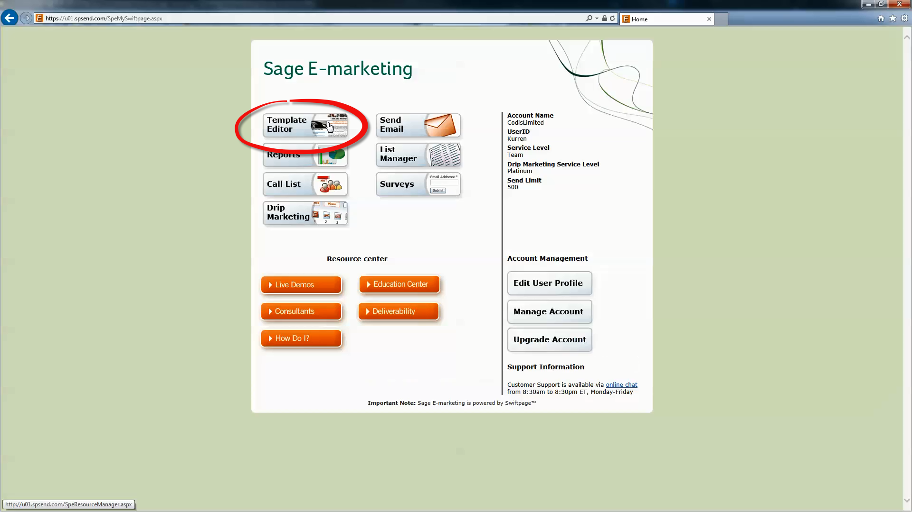 

In **Internet Explorer**, click on **Tools** (looks like a cog wheel on the top right of the screen) and then **Compatibility view settings**. 

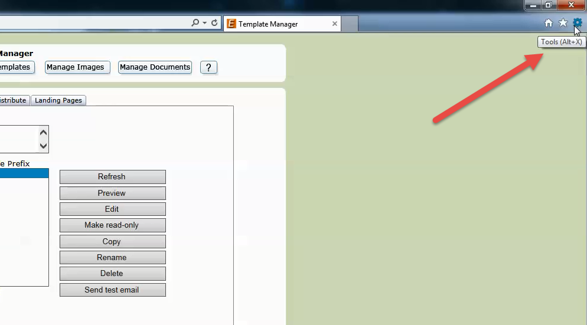 

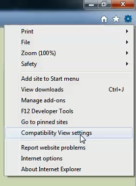 

Exit Internet Explorer and log back in again. 

## Creating a new template

To create a new template that already contains the Codis branding, select the template named **Codis\_kurren\_new** and click **copy**. 

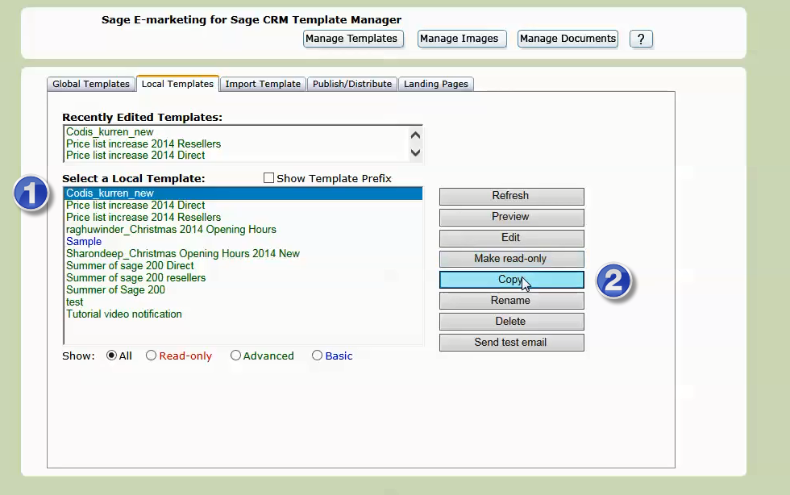 

Name the template something appropriate for the e\-shot, and click **copy**. 

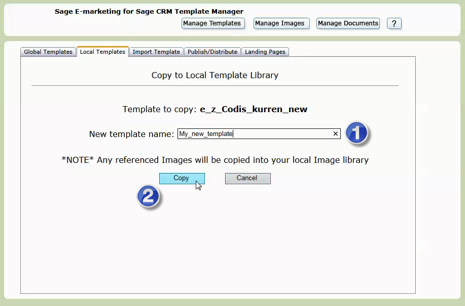 

From here you may edit the **copied** template. 

## Editing a template

Select the template end choose **edit**. This will take you to the editor where you can click and type in the required areas. 

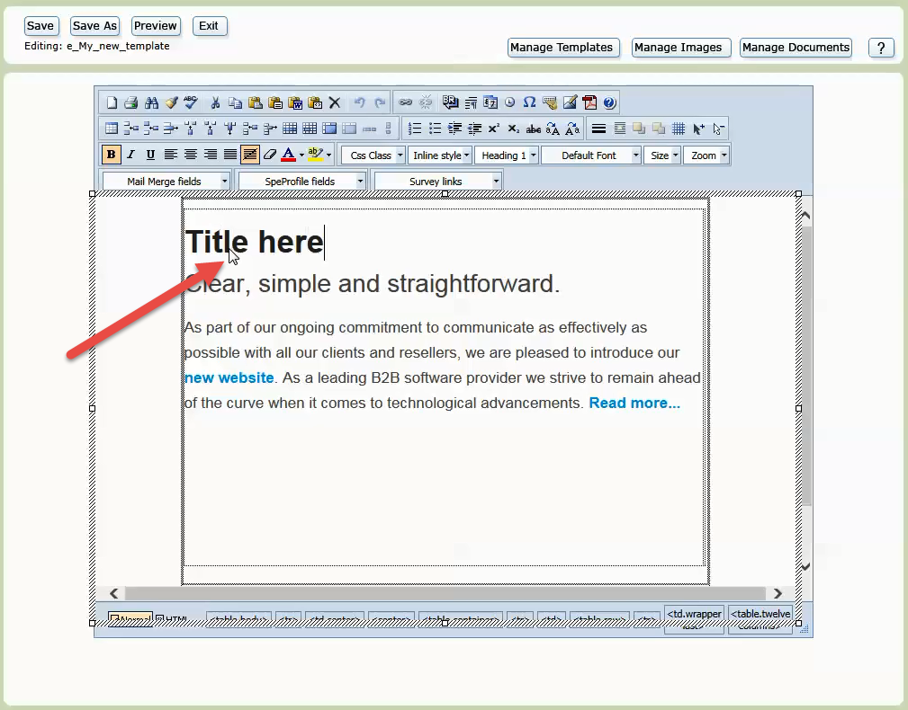 

### Merge fields

Merge fields are used to allow your emails to become more personalised to each individual you are sending to. After you insert a specific tag within your email, when you send out your emails from your database, the tag will be replaced with the data in that field each email recipient. 

To add a merge field, click the mouse where you'd like the merged field to appear. From the Mail Merge Fields drop\-down menu in the top left, select the merged field you'd like to input: 

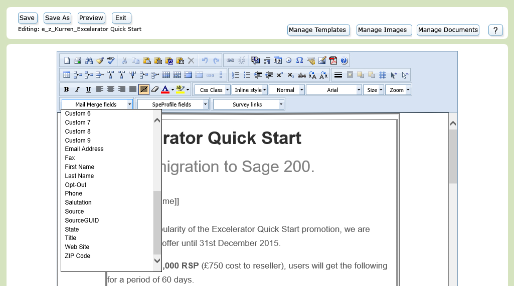 

### Saving

Once finished click **save** on the top left. 

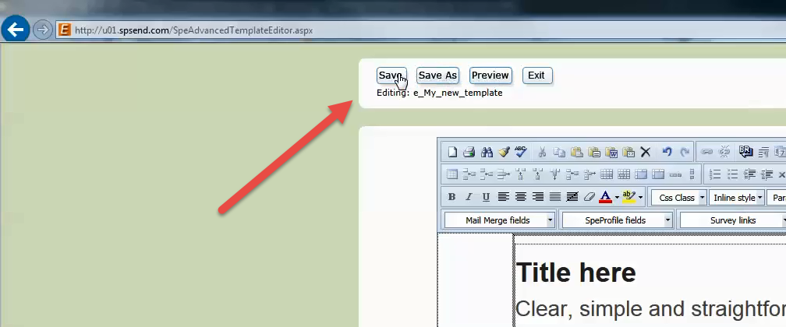 

A preview will be shown. Scroll to the bottom and check if the footer is visible. If so, click **verify**. 

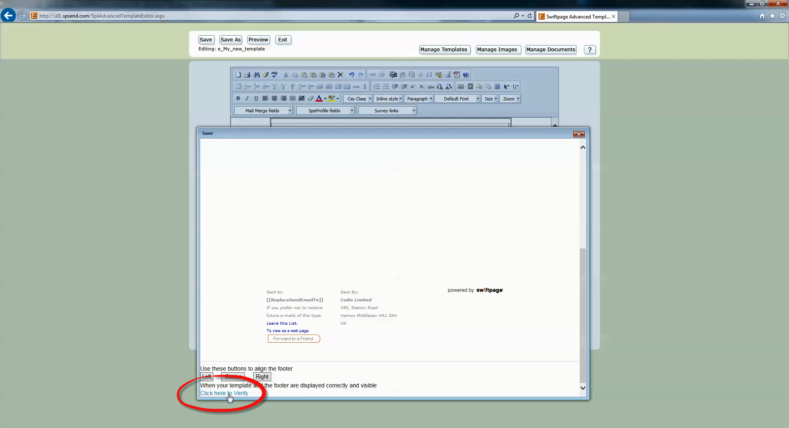 

**IMPORTANT**: Once saved, click the exit button (rather than just closing the web browser or navigating to a different page). 

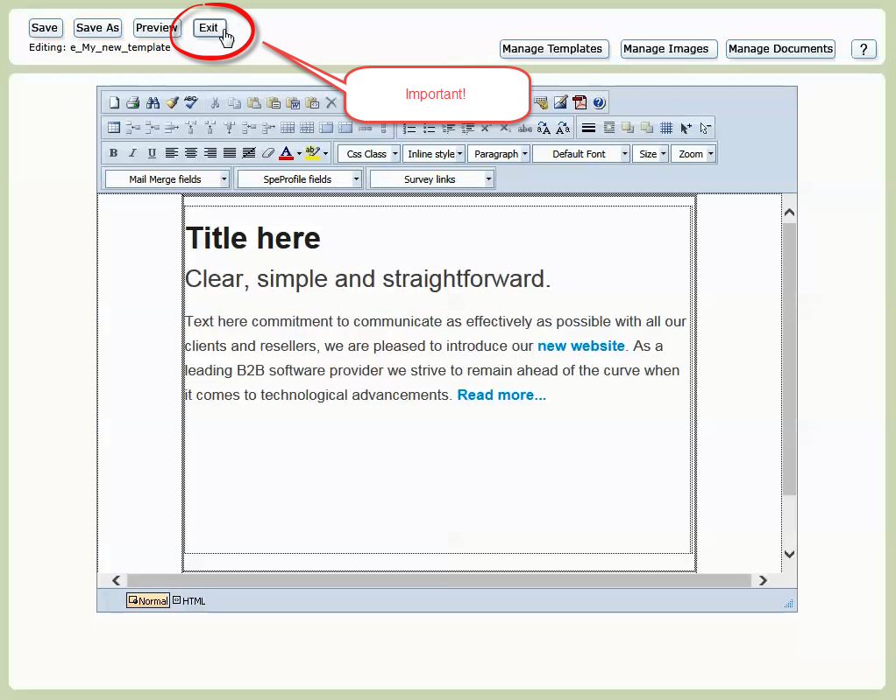 

If you don't click the exit button, the e\-shot will not send and it will **not** give a reason for not sending.

Next publish the template. 

## Publishing a template

Click on the **Publish/Distribute** tab and select your template. Click the **Publish** button. 

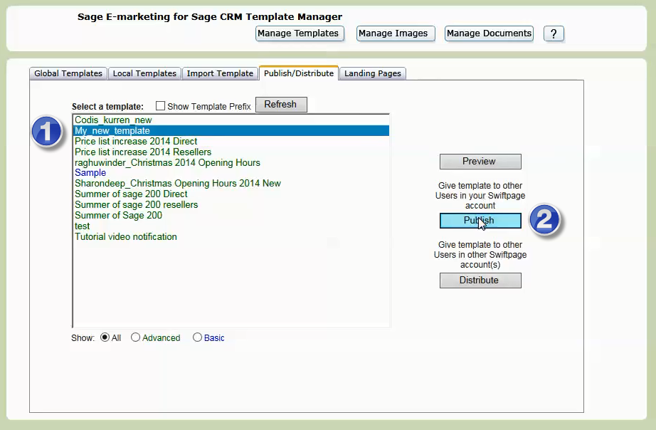 

Choose all recipients and click **Add**, then **Next**. Some recipients may come back as invalid, in which case you can continue with all valid recipients. 

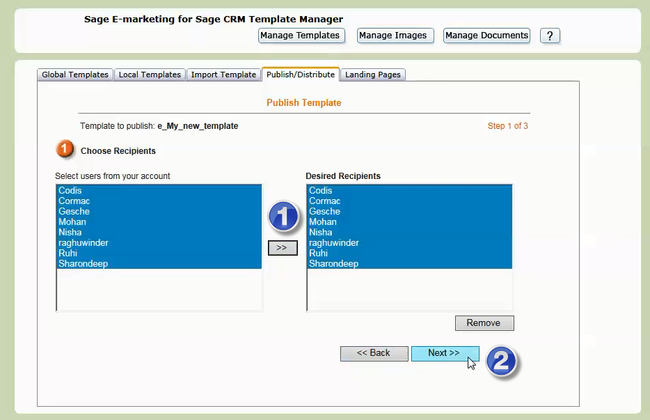
