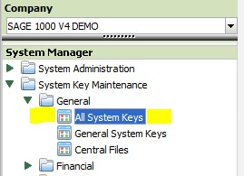
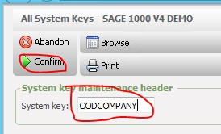
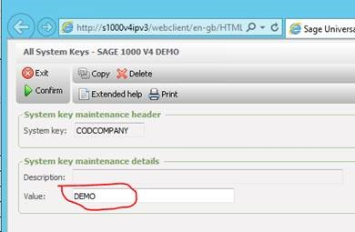

Please see step by step instructions and screenshots below on how to set system keys on Sage yourself . if you don't have this option you will have to ask a system manger (IT) to do that for you.

 

Search CODCOMPANY as shown below 

 

Then, Enter Company name as Value (in this case its demo) and confirm.

 

Now close all excel and open and try again. 

There might be other system keys i.e. CODVERSION and INTUSER you might need to set up as well. To which value for CODVERSION will be your Sage version number, and INTUSER – value would be CODIS.

To get greater detail on configuring system keys, Please click on link below.

[http://www.codis.co.uk/excelerator\-help/quick\-installation\-instructions/sage\-500\-1000\-specific\-issues/system\-keys](http://www.codis.co.uk/excelerator-help/quick-installation-instructions/sage-500-1000-specific-issues/system-keys)
