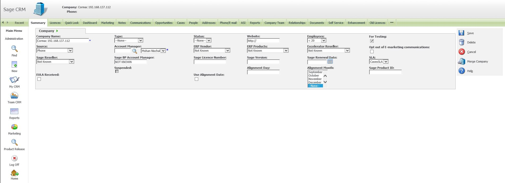

The following explains how to configure a test CRM company specifically for testing. 

## CRM Company

To get an internal testing licence will require that we create a new company in CRM. 

### Naming Convention

Use the name of the person followed by their local hyper name. e.g.   
Asim CS200V2011   
Kurren SAGE1000V4   
Suraj S200C2017

Create a fictious username and make a generic gmail id as userfirstname.hypername@gmail.com (For Example: Suraj.S200C2017@gmail.com) and make this a licence administrator for this company.  
   
**Please Note:** It is very important not to create users for test hyper\-v CRM companies as Codis employees actual username and their actual email IDs so as to avoid any confusion while filling and tagging emails in CRM against their correct identity for Codis.  
 

### Testing check box

**Remember to check the for testing checkbox and set the company status to Inactive.**

