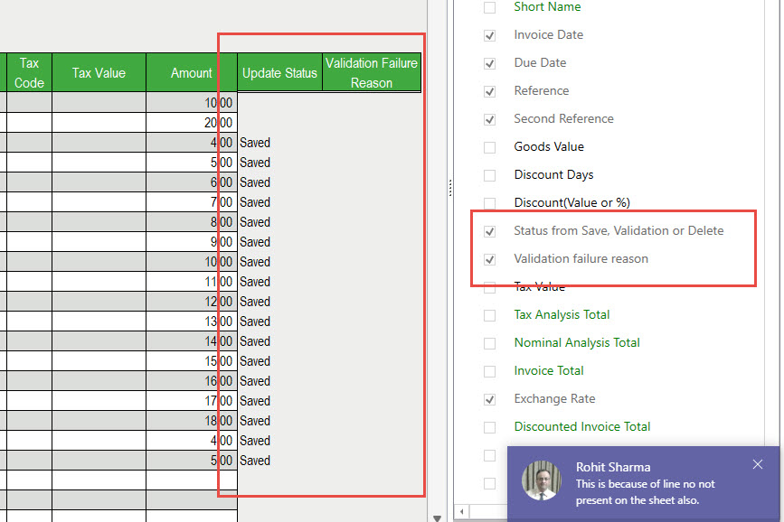
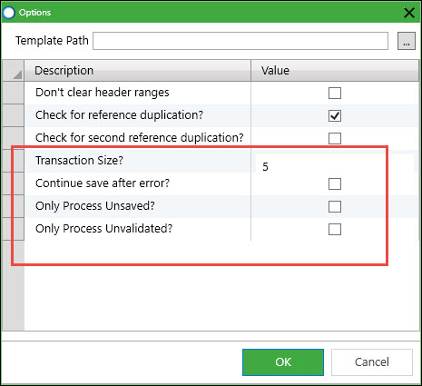

Before the new transaction size and update status functionality, multiple SL or PL Invoices could be validated and saved using sheets like this:  

  

| Account | Name | Type | Reference | Invoice Date | DueDate | Second Reference | Exchange Rate | Nominal | Cost Centre | Dept | Narrative | Tax Code | Tax Value | Amount |
| --- | --- | --- | --- | --- | --- | --- | --- | --- | --- | --- | --- | --- | --- | --- |
| BET001 | Better Kitchens | Invoice | SeanRef1 |  |  |  |  | 02100 |  |  |  |  |  | 10\.00 |
|  |  |  |  |  |  |  |  | 03100 |  |  |  |  |  | 20\.00 |
| BET001 |  |  | SeanRef2 |  |  |  |  | 02100 |  |  |  |  |  | 4\.00 |
| BET001 |  |  | SeanRef3 |  |  |  |  | 02100 |  |  |  |  |  | 5\.00 |
| BET001 |  |  | SeanRef4 |  |  |  |  | 02100 |  |  |  |  |  | 6\.00 |
| BET001 |  |  | SeanRef5 |  |  |  |  | 02100 |  |  |  |  |  | 7\.00 |
| BET001 |  |  | SeanRef6 |  |  |  |  | 02100XX |  |  |  |  |  | 8\.00 |

  

In this case, the invalid nominal code on line 7 would be detected and reported to the user, and when saving no data will be saved.  This is the simplest and best behaviour for the end user and this functionality will remain.  However, this all\-or\-nothing approach only possible if all the data is validated and saved in one go, and the save taking place in one transaction.  If there are large data volumes, this will consume increasing amounts of memory, slowing the program and possibly causing it to fail.  

We can instead choose to validate and save in batches, but then the user has to be aware of exactly which data has saved to be able to avoid reprocessing saved data.  

To deal with this we have introduced new ranges that will be populated with the results of validations or saves.  

  

These can be used by themselves just to return results of validation and saves to the sheet.  

But their real power is when they are used inconjunction with the batching and some new options that tell Excelerator to ignore rows that are marked as already processed.  

The new options are:  

  

- Transaction Size determines the batch size.    A larger number will reduce round trips between Excelerator and Sage and the setup cost of transactions, and a small number will reduce the transaction size.
- Continue save after error? \- tells Excelerator to continue saving after an errorneous invoice is found (not saving that invoice).
- Only Process Unsaved? \- tells Excelerator to ignore any invoices with "Saved" in the Update Status column.
- Only Process Unvalidated? \- tells Excelerator to ignore any invoices marked as "Valid" in the Update Status column when validated.

Together, these options allow a batched save that records which invoices are saved on the sheet.  Any invalid records can be corrected and the validation or save can be run again, and all previously saved invoices will be ignored.
