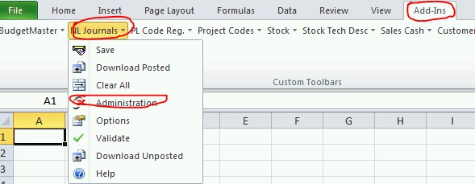
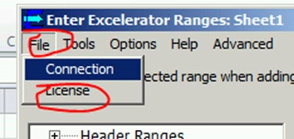
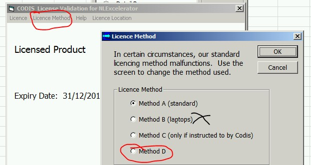
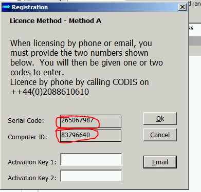
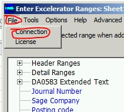

# Licensing

## Open Excel as Administrator (see below)

 

## Click on Administration tab in NL Journals via Add\-Ins tab in Excel (see below)

 ## Select License on File tab.

 ## Then select License Method and please make sure if its PC select Method A and for Laptop Method D.

 ## Activation Code (at this stage call our licensing team on 0208 8610 610 option2 and provide them the code and they will guide you from there)

# 

  # Entering connection detail (see below)

 ## After entering details Click on Test (to check if details entered are correct).

# 

## Once connection Successful, click OK, close excel and open Excel as normal.
